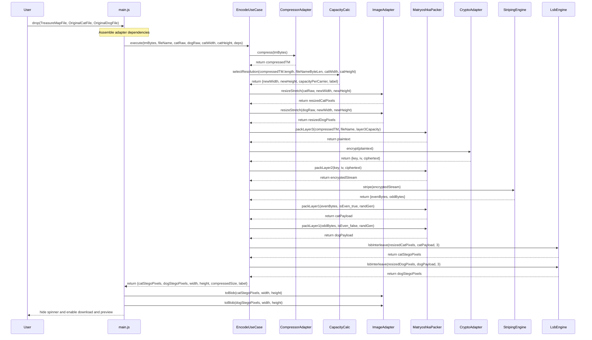
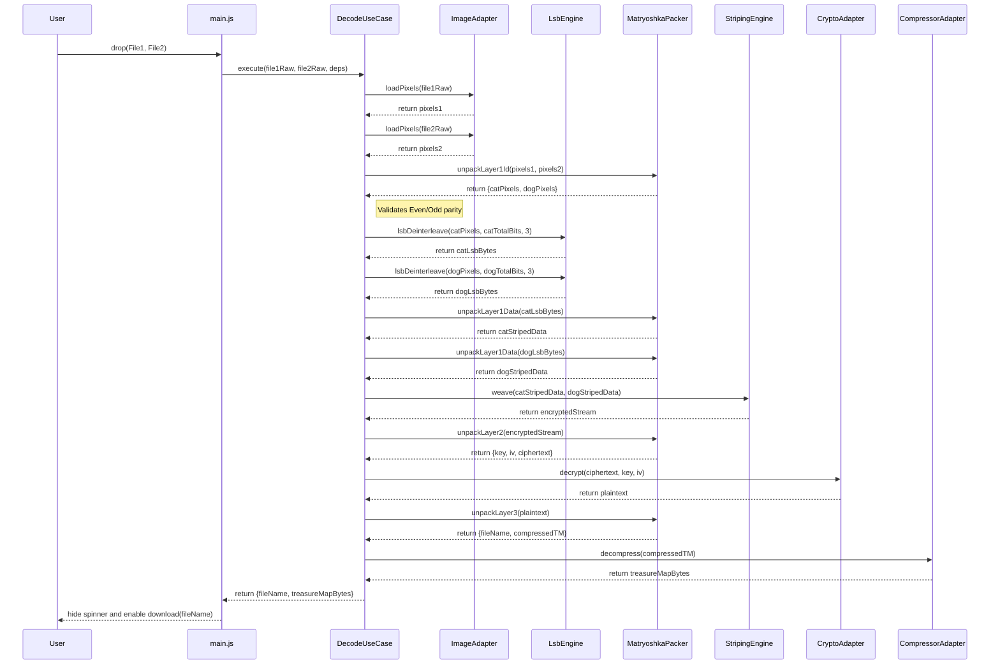

## 7. Data Flow

### 7.1 Encode Data Flow

**contents_name:**
encode_data_flow

```mermaid
sequenceDiagram
    participant User
    participant Main as main.js
    participant Encode as EncodeUseCase
    participant Comp as CompressorAdapter
    participant Cap as CapacityCalc
    participant Img as ImageAdapter
    participant Pack as MatryoshkaPacker
    participant Crypto as CryptoAdapter
    participant Stripe as StripingEngine
    participant Lsb as LsbEngine

    User ->> Main : drop(TreasureMapFile, OriginalCatFile, OriginalDogFile)
    Note over Main: Assemble adapter dependencies
    Main ->> Encode : execute(tmBytes, fileName, catRaw, dogRaw, catWidth, catHeight, deps)

    Encode ->> Comp : compress(tmBytes)
    Comp -->> Encode : return compressedTM

    Encode ->> Cap : selectResolution(compressedTM.length, fileNameByteLen, catWidth, catHeight)
    Cap -->> Encode : return {newWidth, newHeight, capacityPerCarrier, label}

    Encode ->> Img : resizeStretch(catRaw, newWidth, newHeight)
    Img -->> Encode : return resizedCatPixels
    Encode ->> Img : resizeStretch(dogRaw, newWidth, newHeight)
    Img -->> Encode : return resizedDogPixels

    Encode ->> Pack : packLayer3(compressedTM, fileName, layer3Capacity)
    Pack -->> Encode : return plaintext

    Encode ->> Crypto : encrypt(plaintext)
    Crypto -->> Encode : return {key, iv, ciphertext}

    Encode ->> Pack : packLayer2(key, iv, ciphertext)
    Pack -->> Encode : return encryptedStream

    Encode ->> Stripe : stripe(encryptedStream)
    Stripe -->> Encode : return {evenBytes, oddBytes}

    Encode ->> Pack : packLayer1(evenBytes, isEven_true, randGen)
    Pack -->> Encode : return catPayload
    Encode ->> Pack : packLayer1(oddBytes, isEven_false, randGen)
    Pack -->> Encode : return dogPayload

    Encode ->> Lsb : lsbInterleave(resizedCatPixels, catPayload, 3)
    Lsb -->> Encode : return catStegoPixels
    Encode ->> Lsb : lsbInterleave(resizedDogPixels, dogPayload, 3)
    Lsb -->> Encode : return dogStegoPixels

    Encode -->> Main : return {catStegoPixels, dogStegoPixels, width, height, compressedSize, label}
    Main ->> Img : toBlob(catStegoPixels, width, height)
    Main ->> Img : toBlob(dogStegoPixels, width, height)
    Main -->> User : hide spinner and enable download and preview
```

### 7.2 Decode Data Flow

**contents_name:**
decode_data_flow

```mermaid
sequenceDiagram
    participant User
    participant Main as main.js
    participant Decode as DecodeUseCase
    participant Img as ImageAdapter
    participant Lsb as LsbEngine
    participant Pack as MatryoshkaPacker
    participant Stripe as StripingEngine
    participant Crypto as CryptoAdapter
    participant Comp as CompressorAdapter

    User ->> Main : drop(File1, File2)
    Main ->> Decode : execute(file1Raw, file2Raw, deps)

    Decode ->> Img : loadPixels(file1Raw)
    Img -->> Decode : return pixels1
    Decode ->> Img : loadPixels(file2Raw)
    Img -->> Decode : return pixels2

    Decode ->> Pack : unpackLayer1Id(pixels1, pixels2)
    Pack -->> Decode : return {catPixels, dogPixels}
    Note right of Decode: Validates Even/Odd parity

    Decode ->> Lsb : lsbDeinterleave(catPixels, catTotalBits, 3)
    Lsb -->> Decode : return catLsbBytes
    Decode ->> Lsb : lsbDeinterleave(dogPixels, dogTotalBits, 3)
    Lsb -->> Decode : return dogLsbBytes

    Decode ->> Pack : unpackLayer1Data(catLsbBytes)
    Pack -->> Decode : return catStripedData
    Decode ->> Pack : unpackLayer1Data(dogLsbBytes)
    Pack -->> Decode : return dogStripedData

    Decode ->> Stripe : weave(catStripedData, dogStripedData)
    Stripe -->> Decode : return encryptedStream

    Decode ->> Pack : unpackLayer2(encryptedStream)
    Pack -->> Decode : return {key, iv, ciphertext}

    Decode ->> Crypto : decrypt(ciphertext, key, iv)
    Crypto -->> Decode : return plaintext

    Decode ->> Pack : unpackLayer3(plaintext)
    Pack -->> Decode : return {fileName, compressedTM}

    Decode ->> Comp : decompress(compressedTM)
    Comp -->> Decode : return treasureMapBytes

    Decode -->> Main : return {fileName, treasureMapBytes}
    Main -->> User : hide spinner and enable download(fileName)
```
