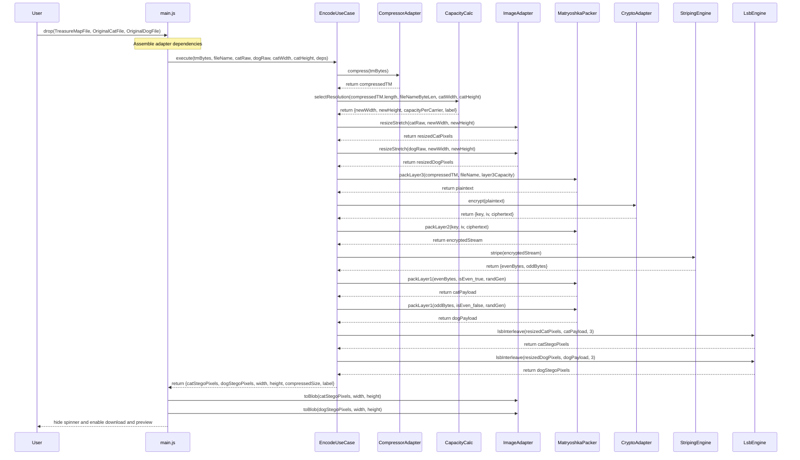
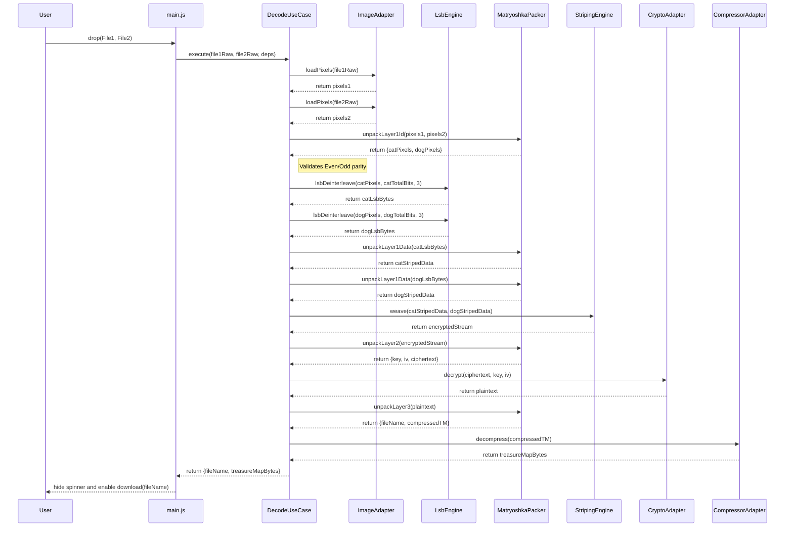
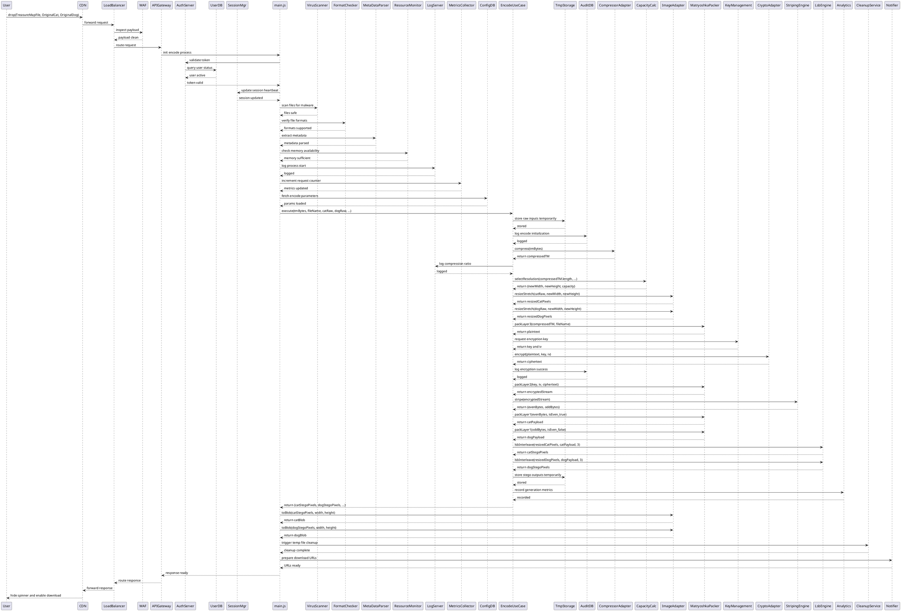
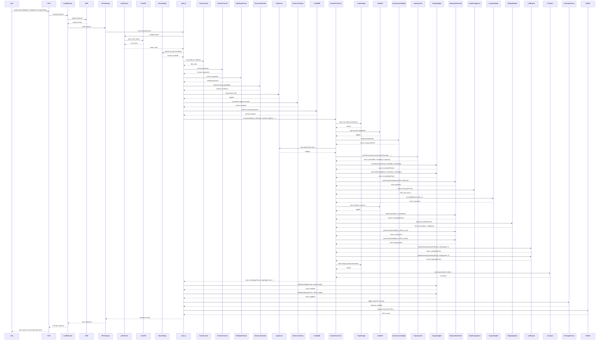

## 7. Data Flow

### 7.1 Encode Data Flow

**contents_name:**
encode_data_flow

### 7.2 Decode Data Flow

**contents_name:**
decode_data_flow

# Super Big Sequence Diagram in PlantUML

# Super Big Sequence Diagram in Mermaid

