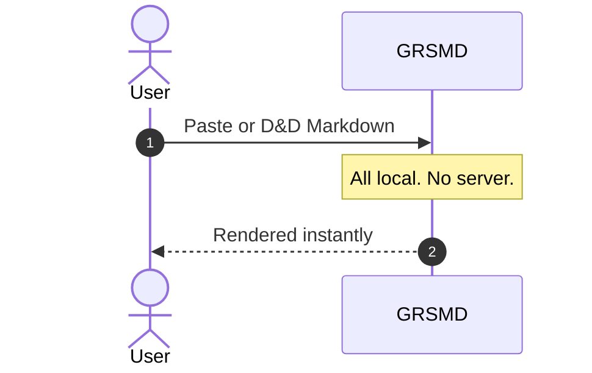
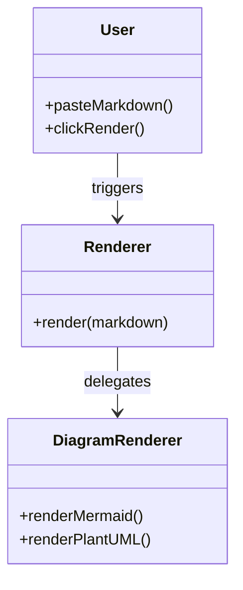

# Sample Data (Try it yourself)

The following diagrams demonstrate how GRSMD renders Markdown and diagrams from user input.

## Sequence Diagram



## Class Diagram

**class_grsmd_rendering:**



## Code Block

**code_image.py:**

```python
# User action
markdown = "...markdown with mermaid..."

# UI layer
html = renderer.render(markdown)

# Core renderer
def render(markdown):
    render_markdown(markdown)
    render_diagrams(markdown)

# Diagram handling
def render_diagrams(markdown):
    if has_mermaid(markdown):
        render_mermaid()
    if has_plantuml(markdown) and user_consented():
        render_plantuml()
```

## Math (LaTeX)

$$
\begin{aligned}
\nabla \cdot \mathbf{E} &= \frac{\rho}{\varepsilon_0} \\
\nabla \cdot \mathbf{B} &= 0 \\
\nabla \times \mathbf{E} &= -\frac{\partial \mathbf{B}}{\partial t} \\
\nabla \times \mathbf{B} &= \mu_0\mathbf{J} + \mu_0\varepsilon_0 \frac{\partial \mathbf{E}}{\partial t}
\end{aligned}
$$
