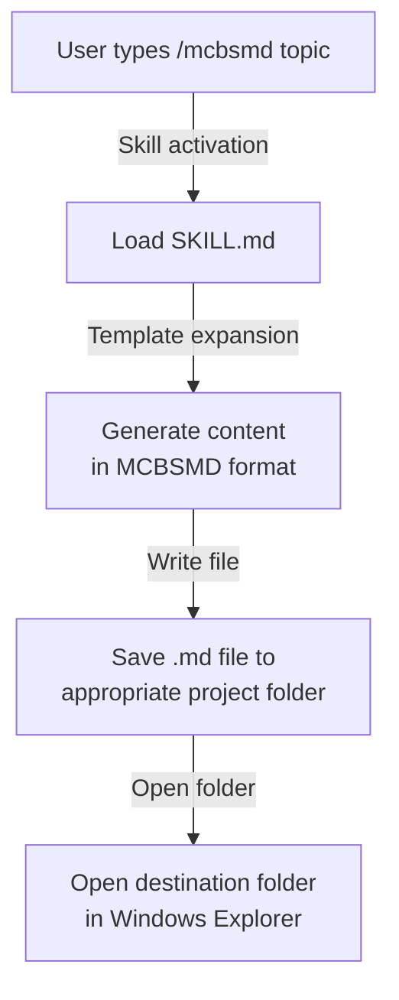
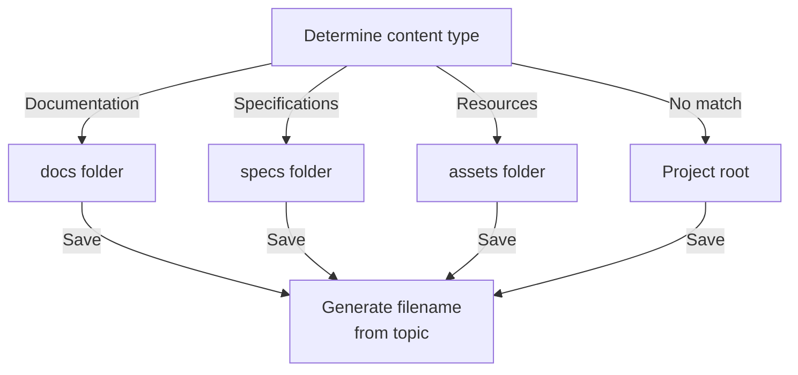
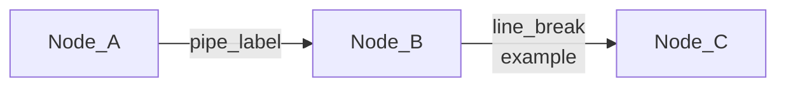
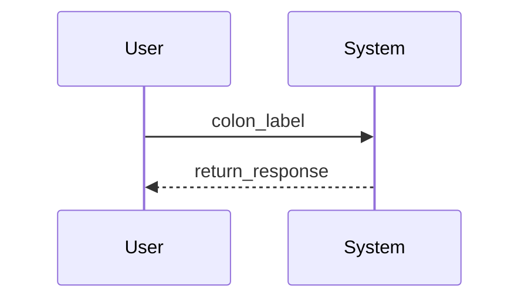

# MCBSMD Skill

## Overview

MCBSMD (Multiple Code Blocks in a Single Markdown) is a custom skill for Claude Code. Simply specify a topic and it automatically generates a structured Markdown document — complete with code blocks, Mermaid diagrams, and math formulas — and saves it as a file.

## Usage

In the Claude Code chat, type `/mcbsmd` followed by a topic.

**Basic syntax:**

```text
/mcbsmd [topic]
```

**Examples:**

```text
/mcbsmd system architecture overview
/mcbsmd login flow
/mcbsmd REST API endpoint list
/mcbsmd database design
```

Topics can be specified in any language.

### Viewing the Generated File

The generated `.md` file may contain Mermaid diagrams and math formulas that don't render correctly in plain text editors. You can get a full preview — including diagrams and formulas — by simply dragging and dropping the file into the viewer below.

> Open **[gr-simple-md-renderer](https://goodrelax.github.io/gr-simple-md-renderer/)** and drag & drop the generated `.md` file onto the page.

## Installation

### Prerequisites

- [Claude Code](https://docs.anthropic.com/en/docs/claude-code) must be installed

### Method A: Ask Claude to install it (Recommended)

Simply give the following instruction in the Claude Code chat:

```text
Install the skill from this URL and make it available as /mcbsmd
https://raw.githubusercontent.com/GoodRelax/gr-simple-md-renderer/refs/heads/main/skills/mcbsmd/SKILL.md
```

Claude will download SKILL.md and place it at `~/.claude/skills/mcbsmd/SKILL.md`. This always fetches the latest version.

### Method B: Manual installation

1. Create the skill directory.

**Create directory:**

```bash
mkdir -p ~/.claude/skills/mcbsmd
```

2. Download SKILL.md with the following command.

**Download:**

```bash
curl -sL https://raw.githubusercontent.com/GoodRelax/gr-simple-md-renderer/refs/heads/main/skills/mcbsmd/SKILL.md \
  -o ~/.claude/skills/mcbsmd/SKILL.md
```

3. Restart Claude Code and the `/mcbsmd` command will be available.

## How It Works

**Processing flow:**



When the skill is activated, content is generated according to the MCBSMD format and saved as a Markdown file in the appropriate project folder. After saving, the folder is automatically opened in Explorer.

### Output Destination Logic

The destination folder is automatically determined based on the nature of the content.

**Destination priority:**



The filename is automatically derived from the topic (e.g., "system architecture overview" → `system-architecture-overview.md`).

## Format Specification

### MCBSMD Format Rules

#### Overall Structure

- The entire output is generated as a single Markdown code block enclosed in **six backticks**.
- This allows the Markdown — which contains nested code blocks — to be copied in one go.

#### Code Block and Diagram Rules

All code blocks and diagrams must follow this structure.

**Code block pattern:**

```markdown
**Title:**

​```language
Code or diagram content (no omissions)
​```

Write the explanation for the code block here, after the block.
```

Requirements for each block:
- A heading in `**Title:**` format immediately before the block
- A code fence with language specification (e.g., `python`, `mermaid`, `json`)
- An explanation immediately after the block (not inside the block)

#### Diagram Rules

- Use **Mermaid** by default (use PlantUML only when Mermaid cannot express the diagram)
- All arrows and relationship lines **must have labels**

**Mermaid flowchart label notation:**



In flowchart / graph, labels are enclosed in pipes `|...|`. For line breaks, use `<br/>` inside a quoted string.

**Other Mermaid diagram label notation:**



In Mermaid diagrams other than flowchart (e.g., sequence diagrams), labels are placed after the arrow using a colon `:`.

#### Character Constraints in Diagrams

- Prefer alphanumeric characters and underscores (`_`)
- Non-ASCII text (e.g., Japanese) is allowed without spaces
- Special symbols (`\` `/` `|` `<` `>` `{` `}`) are **prohibited**

#### Math Rules

Standard LaTeX notation is used for all mathematical formulas.

- **Inline math**: Enclose with `$`. Place a space before the opening `$` and after the closing `$` (e.g., `The function is $y = x + 1$ here.`)
- **Block equations**: Place `$$` on its own line above and below the formula

**Block equation example:**

```markdown
$$
E = mc^2
$$
```

`$$` must always be on its own line before and after the formula.

### Skill Definition Settings

| Setting | Value | Description |
|---|---|---|
| `name` | `mcbsmd` | Skill name (slash command) |
| `description` | Output in MCBSMD format | Skill description |
| `argument-hint` | `[topic]` | Argument hint display |
| `allowed-tools` | `Write, Bash` | Available tools |

### Notes

- **No speculation or fabrication is output.** If something is unclear, it is explicitly stated.
- **Code and diagrams are output in full** without omission. Shorthand such as `...` is prohibited.
- **`allowed-tools`** is limited to `Write` and `Bash`, so only file writing and folder opening are performed during skill execution.
