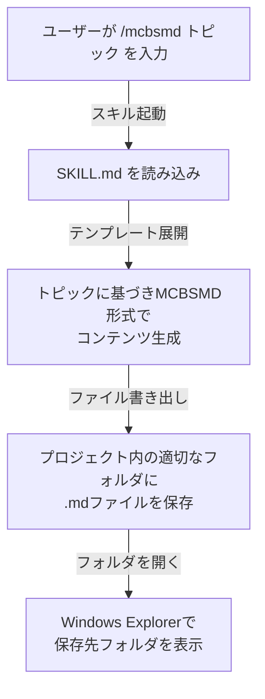
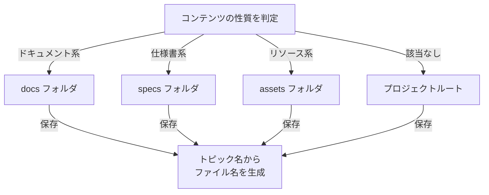
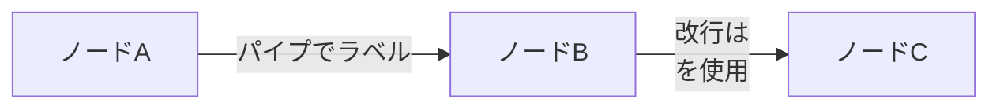
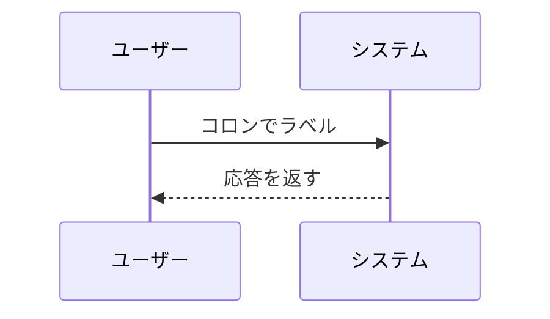

# MCBSMDスキル

## 概要

MCBSMD（Multiple Code Blocks in a Single Markdown）は、Claude Code 用のカスタムスキルです。トピックを指定するだけで、コードブロック・Mermaid図・数式を含む構造化Markdownドキュメントを自動生成し、ファイルとして保存します。

## 使い方

Claude Code のチャットで `/mcbsmd` に続けてトピックを入力します。

**基本構文:**

```text
/mcbsmd [トピック]
```

**呼び出し例:**

```text
/mcbsmd システムアーキテクチャの概要
/mcbsmd ログイン処理フロー
/mcbsmd REST APIエンドポイント一覧
/mcbsmd データベース設計
```

トピックは日本語でも英語でも指定可能です。

### 生成したファイルの閲覧

生成された `.md` ファイルは、Mermaid図や数式を含むためそのままでは正しく表示されない場合があります。以下のビューアにドラッグ&ドロップするだけで、図や数式を含めた完全なプレビューが可能です。

> **[gr-simple-md-renderer](https://goodrelax.github.io/gr-simple-md-renderer/)** を開き、生成された `.md` ファイルをページ上にドラッグ&ドロップしてください。

## インストール

### 前提条件

- [Claude Code](https://docs.anthropic.com/en/docs/claude-code) がインストール済みであること

### 手順

1. スキルディレクトリを作成します。

**ディレクトリ作成:**

```bash
mkdir -p ~/.claude/skills/mcbsmd
```

2. 以下の内容で `~/.claude/skills/mcbsmd/SKILL.md` を作成します。

**SKILL.md:**

```markdown
---
name: mcbsmd
description: Output content in MCBSMD (Multiple Code Blocks in a Single Markdown) format. Use when the user wants structured documentation with code blocks and diagrams saved as a .md file.
disable-model-invocation: true
argument-hint: [topic]
allowed-tools: Write, Bash
---

（SKILL.md の本文はリポジトリの SKILL.md を参照）
```

3. Claude Code を再起動すると `/mcbsmd` コマンドが使えるようになります。

## 動作フロー

**処理フロー:**



スキルが起動すると、MCBSMD形式に従ってコンテンツが生成され、プロジェクト内の適切なフォルダにMarkdownファイルとして保存されます。保存後、Explorerでフォルダが自動的に開きます。

### 保存先の決定ロジック

保存先はコンテンツの性質に基づいて自動決定されます。

**保存先の優先順位:**



ファイル名はトピックから自動導出されます（例: 「システムアーキテクチャの概要」→ `system-architecture-overview.md`）。

## 仕様詳細

### MCBSMD形式のルール

#### 全体構造

- 出力全体を **6つのバッククォート** で囲んだ単一のMarkdownコードブロックとして生成します。
- これにより、コードブロックを内包するMarkdownをそのままコピー可能にします。

#### コードブロックと図のルール

すべてのコードブロック・図には以下の構造が必要です。

**コードブロックの記述パターン:**

```markdown
**タイトル:**

​```言語
コードや図の内容（省略なし）
​```

ここにコードブロックの説明を記述する。
```

各ブロックの要件：
- ブロック直前に `**タイトル:**` 形式の見出し
- 言語指定付きのコードフェンス（例: `python`, `mermaid`, `json`）
- ブロック直後に説明文（ブロック内部には説明を書かない）

#### 図（ダイアグラム）のルール

- 図は原則 **Mermaid** を使用（Mermaidで表現できない場合のみPlantUML）
- すべての矢印・関係線には **ラベルが必須**

**Mermaid flowchart のラベル記法:**



flowchart / graph ではパイプ `|...|` でラベルを囲みます。改行にはクォート内で `<br/>` を使用します。

**その他のMermaid図のラベル記法:**



シーケンス図などflowchart以外のMermaid図では、矢印の後にコロン `:` でラベルを付けます。

#### 図の文字制約

- 英数字とアンダースコア `_` を優先
- 非ASCII文字（日本語など）はスペースなしで使用可能
- 特殊記号（ `\` `/` `|` `<` `>` `{` `}` ）は **使用禁止**

#### 数式のルール

数式にはLaTeX記法を使用します。

- **インライン数式**: `$` で囲む。前後にスペースを置く（例: `関数は $y = x + 1$ である。`）
- **ブロック数式**: `$$` を独立した行に配置する

**ブロック数式の例:**

```markdown
$$
E = mc^2
$$
```

`$$` は必ず数式の前後で独立した行に置きます。

### スキル定義ファイルの設定項目

| 設定項目 | 値 | 説明 |
|---|---|---|
| `name` | `mcbsmd` | スキル名（スラッシュコマンド名） |
| `description` | MCBSMD形式で出力 | スキルの説明 |
| `disable-model-invocation` | `true` | モデルによる自動呼び出しを無効化 |
| `argument-hint` | `[topic]` | 引数のヒント表示 |
| `allowed-tools` | `Write, Bash` | 使用可能なツール |

### 注意事項

- **推測や虚偽の情報は出力されません。** 不明な点がある場合は、その旨が明記されます。
- **コードや図は省略なし** で出力されます。`...` などの省略記法は使用禁止です。
- **`allowed-tools`** が `Write` と `Bash` に限定されているため、スキル実行中はファイル書き込みとフォルダ展開のみが行われます。
