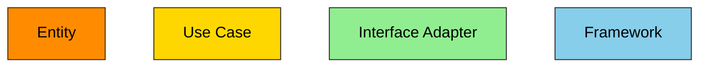
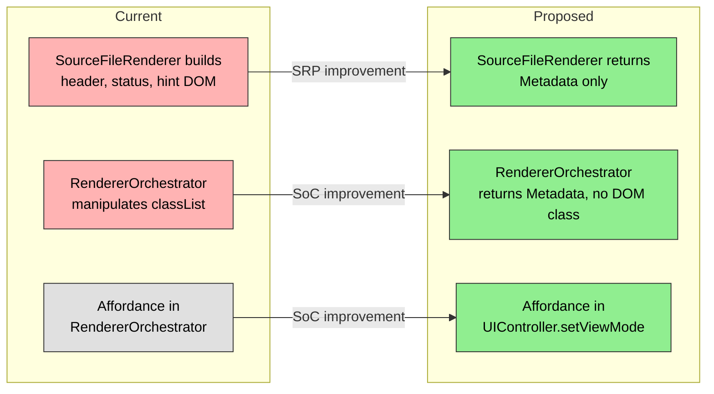

# GRSMD Proposed Architecture Review

Clean Architecture (CA) の観点から、提案中の仕様変更後のアーキテクチャをレビューする。

---

## 1. CA Layer Color Legend

**CA Layer Color Mapping:**



CA の各レイヤーに対応する色。依存は外側から内側へのみ許容される。

---

## 2. Component Diagram (Proposed)

**GRSMD Component Architecture:**

```mermaid
flowchart TB
    classDef entity fill:#FF8C00,stroke:#333,color:#000
    classDef usecase fill:#FFD700,stroke:#333,color:#000
    classDef adapter fill:#90EE90,stroke:#333,color:#000
    classDef framework fill:#87CEEB,stroke:#333,color:#000

    subgraph Entity_Layer
        direction LR
        AS["ApplicationState"]:::entity
        CFG["CONFIG"]:::entity
    end

    subgraph UseCase_Layer
        RO["RendererOrchestrator"]:::usecase
    end

    subgraph InterfaceAdapter_Layer
        direction TB
        subgraph Input_Adapter
            UI["UIController"]:::adapter
        end
        subgraph Output_Adapters
            direction LR
            MdR["MarkdownRenderer"]:::adapter
            MmR["MermaidRenderer"]:::adapter
            PuR["PlantUMLRenderer"]:::adapter
            SfR["SourceFileRenderer"]:::adapter
            SM["ScrollManager"]:::adapter
        end
        subgraph Autonomous_Adapters
            direction LR
            SSE["SmoothScrollEngine"]:::adapter
            MC["ModalController"]:::adapter
            DZC["DiagramZoomController"]:::adapter
            DPC["DiagramPanController"]:::adapter
            DCC["DiagramCopyController"]:::adapter
        end
    end

    subgraph Framework_Layer
        direction LR
        MAIN["main.js Composition Root"]:::framework
        MARKED["marked.js"]:::framework
        MMJS["mermaid.js"]:::framework
        HLJS["highlight.js"]:::framework
        PUENC["plantuml-encoder"]:::framework
        DOM["DOM and Browser APIs"]:::framework
    end

    UI -->|"loadMarkdown reRender clear"| RO
    UI -->|"renderCodeView returns Metadata"| RO
    RO -->|"reads and writes state"| AS
    RO -->|"reads constants"| CFG
    UI -->|"reads constants"| CFG
    RO -->|"delegates markdown"| MdR
    RO -->|"delegates mermaid"| MmR
    RO -->|"delegates plantuml"| PuR
    RO -->|"delegates code and receives Metadata"| SfR
    RO -->|"save and restore scroll"| SM
    UI -->|"startScroll stopScroll"| SSE
    UI -->|"show and hide"| MC
    MdR -->|"parse"| MARKED
    MmR -->|"render"| MMJS
    PuR -->|"encode"| PUENC
    SfR -->|"highlight"| HLJS
    MAIN -->|"creates and wires all instances"| RO
```



### Diagram Notes

- **Input Adapter**: UIController はユーザーイベント（D&D, paste, keyboard, button）を Use Case 呼び出しに変換する
- **Output Adapters**: 各 Renderer は Use Case からの委譲を受け、外部ライブラリ（Framework）を使って出力を生成する
- **Autonomous Adapters**: SmoothScrollEngine, DiagramControllers 等は独立して動作し、Use Case を経由しない
- **Composition Root**: main.js（Framework 層）が全インスタンスを生成し、コンストラクタ注入で結合する
- **Proposed Change**: SourceFileRenderer が Metadata を返し、UIController がその情報を使って UI chrome を管理する（破線的なデータフロー）

### Source Code Dependency Analysis

UIController.js と RendererOrchestrator.js はいずれも **具象 Renderer クラスを import していない**。
main.js（Composition Root）がコンストラクタ注入で結合するため、
Use Case 層 → Interface Adapter 層への直接的なソースコード依存は存在しない。
これは DIP（依存性逆転の原則）に適合している。

---

## 3. Class Diagram (Proposed)

**GRSMD Class Structure:**

```mermaid
classDiagram
    namespace Entity_Layer {
        class ApplicationState {
            +string markdownText
            +string currentTheme
            +setMarkdownText(text) void
            +setTheme(theme) void
        }
        class CONFIG {
            +object fileDrop
            +object scroll
            +object zoom
            +object codeView
            +object ui
            +object editorColors_PROPOSED
            +object keyHints_PROPOSED
        }
    }

    namespace UseCase_Layer {
        class RendererOrchestrator {
            -string _viewState
            +isPreRenderState() bool
            +isCodeViewActive() bool
            +loadMarkdown(text_theme) Promise
            +renderCodeView(file_handle) Promise~CodeViewMeta~
            +reRender(theme) Promise
            +reloadCodeView(theme) Promise~CodeViewMeta~
            +clear() void
            +renderAll() Promise
        }
        class CodeViewMeta {
            <<data transfer object>>
            +string fileName
            +number fileSize
            +number lineCount
            +string language
            +number lastModified
            +string loadedAtStr
        }
    }

    namespace InterfaceAdapter_Layer {
        class UIController {
            +setViewMode_PROPOSED(mode_meta) void
            +showKeyHint_PROPOSED(mode) void
            -formatFileInfo_PROPOSED(meta) string
            +preprocessInput(rawText) string
            +setupFileDrop() void
            +handleRender(theme) Promise
            +doClear() void
            +setupKeyboard() void
        }
        class SourceFileRenderer {
            +render_CHANGED(file_handle_theme) Promise~CodeViewMeta~
            +reload_CHANGED(theme) Promise~CodeViewMeta~
            +destroy() void
            -buildCodeBody(text_file) string
            -splitHighlightedLines(html) Array
        }
        class MarkdownRenderer {
            +render(text) Promise
        }
        class MermaidRenderer {
            +render(theme) Promise
        }
        class PlantUMLRenderer {
            +render(theme) Promise
        }
        class ScrollManager {
            +save() number
            +restore(pos) void
        }
        class SmoothScrollEngine {
            +startScroll(direction) void
            +stopScroll() void
            +destroy() void
        }
        class ModalController {
            +setupModal(el_closeBtns)$ void
            +show(el)$ void
            +hide(el)$ void
        }
        class DiagramZoomController {
            +zoom(el_direction) void
            +resetZoom(el) void
        }
        class DiagramPanController
        class DiagramCopyController
    }

    UIController --> RendererOrchestrator : orchestrates
    UIController --> SmoothScrollEngine : controls
    UIController --> ModalController : uses
    RendererOrchestrator --> ApplicationState : reads and writes
    RendererOrchestrator --> CONFIG : reads
    RendererOrchestrator --> MarkdownRenderer : delegates
    RendererOrchestrator --> MermaidRenderer : delegates
    RendererOrchestrator --> PlantUMLRenderer : delegates
    RendererOrchestrator --> SourceFileRenderer : delegates
    RendererOrchestrator --> ScrollManager : uses
    RendererOrchestrator ..> CodeViewMeta : returns
    SourceFileRenderer ..> CodeViewMeta : creates
    UIController ..> CodeViewMeta : consumes
    UIController --> CONFIG : reads
```



### Proposed Changes Summary

| Class                | Change                                                         | Rationale                        |
| -------------------- | -------------------------------------------------------------- | -------------------------------- |
| UIController         | +setViewMode(), +showKeyHint(), +\_formatFileInfo()            | UI chrome 管理を SRP で一元化    |
| UIController         | setupFileDrop: editor.value = "" before renderCodeView         | RTC2-07 fix                      |
| UIController         | doClear: +setViewMode(initial), affordance 管理移管            | SoC: 表示責務を Adapter 層に集約 |
| RendererOrchestrator | renderCodeView: classList 操作を削除, Metadata を返す          | Use Case 層から DOM 操作を排除   |
| RendererOrchestrator | loadMarkdown, clear: classList 操作を削除                      | 同上                             |
| RendererOrchestrator | \_showAffordance, \_hideAffordance: UIController へ移管        | SoC                              |
| SourceFileRenderer   | render, reload: Metadata を返す, header/status/hint 生成を削除 | SRP: コード描画のみに専念        |
| SourceFileRenderer   | \_scheduleKeyHintFade: 削除                                    | hint 管理は UIController へ      |
| CONFIG               | +editorColors, +keyHints                                       | Entity 層に定数を集約            |
| CSS                  | body.view-initial/markdown/code + data-theme で背景色を制御    | 宣言的CSS, JS 側の色管理が不要   |

---

## 4. CA Compliance Analysis

### Compliant Points

| Principle | Status     | Detail                                                                  |
| --------- | ---------- | ----------------------------------------------------------------------- |
| DIP       | OK         | main.js がコンストラクタ注入。Use Case は具象 Adapter を import しない  |
| SRP       | OK(提案後) | UIController が全 UI chrome を管理。SourceFileRenderer はコード描画のみ |
| SoC       | OK(提案後) | Use Case 層から DOM classList 操作を排除                                |
| CQS       | OK         | RendererOrchestrator の isPreRenderState, isCodeViewActive は純粋クエリ |
| OCP       | OK         | CONFIG の定数追加で振る舞いを変更可能                                   |
| POLA      | OK(提案後) | setViewMode で全ビュー切替を統一 API 化                                 |

### Pragmatic Violations (Acceptable)

| Item                              | Layer Violation                | Justification                                                     |
| --------------------------------- | ------------------------------ | ----------------------------------------------------------------- |
| RendererOrchestrator.preview      | Use Case が DOM 要素を保持     | waitForDOMStability に必要。インターフェース抽出は YAGNI          |
| RendererOrchestrator.applyTheme() | Use Case が DOM utility を呼出 | テーマはレンダリング状態の一部。Mermaid/PlantUML の描画結果に影響 |
| CONFIG に UI 文字列を含む         | Entity に表示文言が混在        | プロジェクト規模に対して分離は過剰。KISS 優先                     |
| utils.js が DOM 操作を含む        | 層境界が曖昧                   | 薄いユーティリティ。個別クラス化は YAGNI                          |

### Proposed Improvements vs Current



主要な改善: Interface Adapter 層（SourceFileRenderer）が Use Case 層（RendererOrchestrator）を経由して別の Interface Adapter（UIController）にデータを返す構造になり、各層の責務が明確化される。

---

## 5. Open Questions

1. **RendererOrchestrator.\_showAffordance 移管**: UIController に移す場合、main.js の `orchestrator._showAffordance()` を `UIController` 初期化内の `setViewMode('initial')` に置き換える。RendererOrchestrator の public API から affordance 関連メソッドを完全に削除してよいか？

2. **reloadCodeView の戻り値**: テーマ変更時（l/d キー）の reloadCodeView で Metadata を返す必要があるか？ fileInfo 表示内容は変わらないため void でも可。ただし統一性のために Metadata を返す案もある。

---

## 6. Chat Split Recommendation

**推奨: このチャットでレビューを完了し、コーディングは新チャットで行う**

理由:

- このチャットは既にコンテキスト圧縮が発生しており、コーディング中に再度圧縮される可能性が高い
- アーキテクチャレビューと実装を分離することで、レビュー結果を明確な仕様として新チャットに渡せる

### Continuation Prompt (新チャット用)

以下を新チャットの最初のプロンプトとして貼り付ける:

```text
前回のチャットでアーキテクチャレビューが完了した。
以下の承認済み仕様に基づき、コーディングを行え。

## Bug Fix
- RTC2-07: setupFileDrop の Code View パス (Stage 2, Stage 4/5) で
  renderCodeView 呼出前に this.elements.editor.value = "" を追加

## Spec Changes (承認済み)
UIController に setViewMode(mode, metadata?) を新設し、全ビュー状態管理を一元化する。

### 1. setViewMode(mode, metadata?)
- body に view-initial / view-markdown / view-code クラスを設定
- mode=code: #fileInfo に metadata をフォーマットして表示、#editor を readonly/非表示
- mode=markdown: #fileInfo を非表示、#editor を通常表示
- mode=initial: affordance 表示、#fileInfo 非表示、#editor を通常表示

### 2. showKeyHint(mode)
- #keyHint 要素に mode に応じたショートカットヒントを表示
- markdown: [up][dn] scroll  [l] light  [d] dark  [c] clear  [n] new tab
- code: [up][dn] scroll  [l] light  [d] dark  [c] clear  [n] new tab
- initial: 表示なし
- フェードアウト (CONFIG.codeView.keyHintDurationMs 後)

### 3. Editor Background Colors (CSS)
body.view-markdown[data-theme="light"] #editor { background: #FFF8F0; }
body.view-markdown[data-theme="dark"] #editor  { background: #2D2520; }
body.view-code[data-theme="light"] #editor     { background: #F0F4FF; }
body.view-code[data-theme="dark"] #editor      { background: #1A1E2E; }

### 4. SourceFileRenderer Changes
- render() / reload(): CodeViewMeta を返す { fileName, fileSize, lineCount, language, lastModified, loadedAtStr }
- _buildDOM を _buildCodeBody にリネーム: header/status/hint を生成しない
- _scheduleKeyHintFade() 削除

### 5. RendererOrchestrator Changes
- renderCodeView(): preview.classList 操作を削除、metadata を返す
- loadMarkdown(), clear(): preview.classList 操作を削除
- _showAffordance(), _hideAffordance(): UIController へ移管し削除
- reloadCodeView(): metadata を返す

### 6. HTML Changes
- #editor の後に <div id="fileInfo"></div> を追加
- #topbar 内（適切な位置）に <div id="keyHint"></div> を追加

### 7. main.js Changes
- elements に fileInfo, keyHint を追加
- orchestrator._showAffordance() 呼出を削除（UIController が初期化時に setViewMode('initial') を呼ぶ）

### Test Requirements
- 既存 119 テスト全パス維持
- setViewMode, showKeyHint の新規テスト追加
- npm run build で docs/index.html 生成

### Design Principles
KISS, YAGNI, DRY, SoC, SRP, OCP, LSP, ISP, DIP, SLAP, LOD, CQS, POLA を遵守
```
