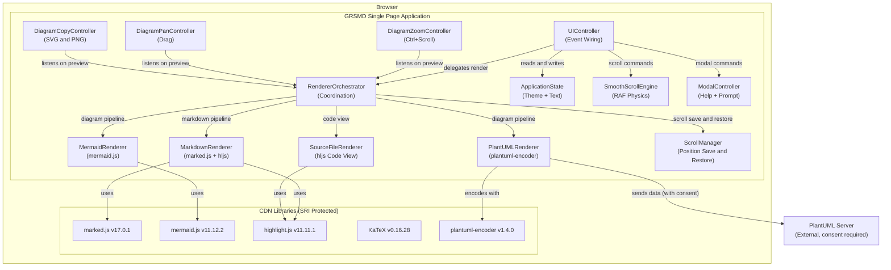
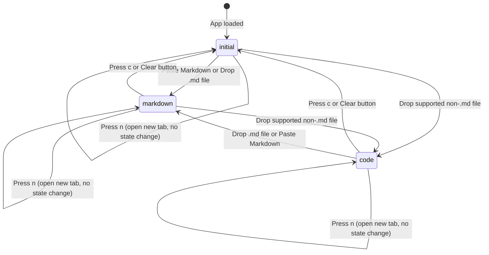
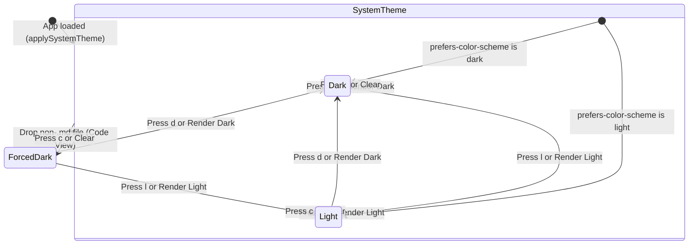
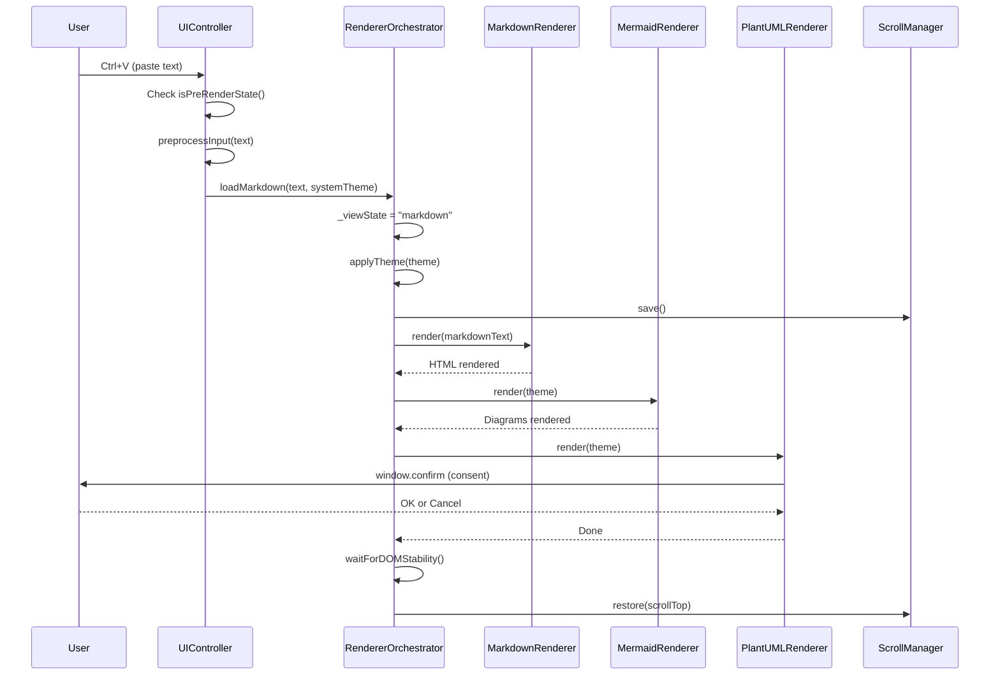
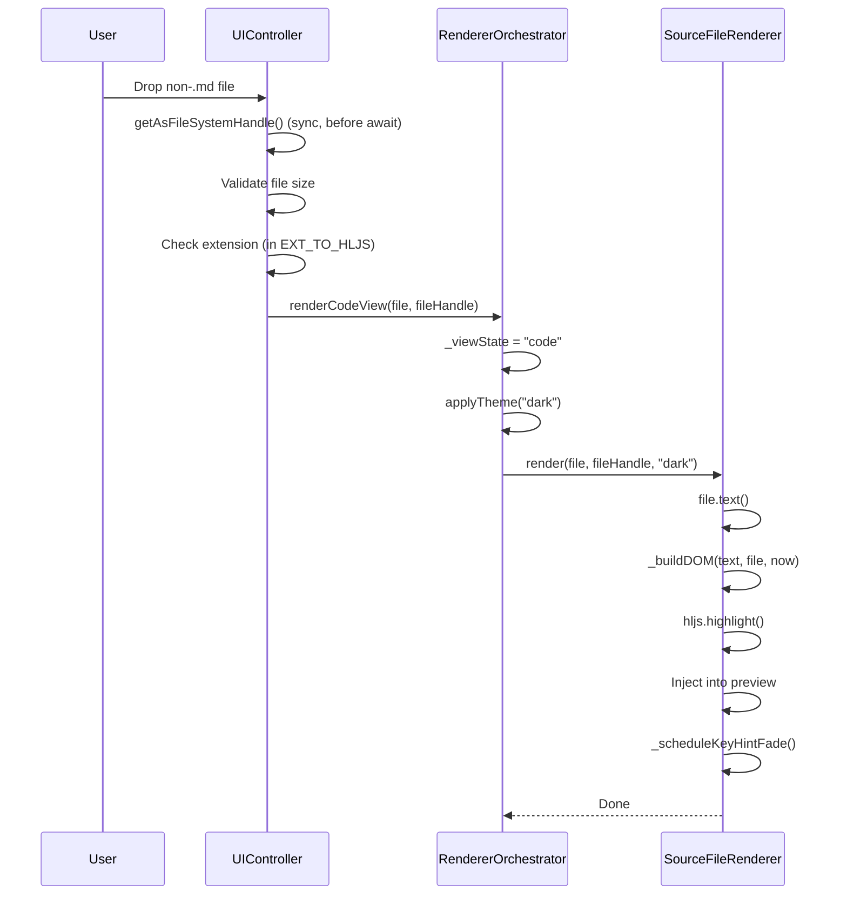
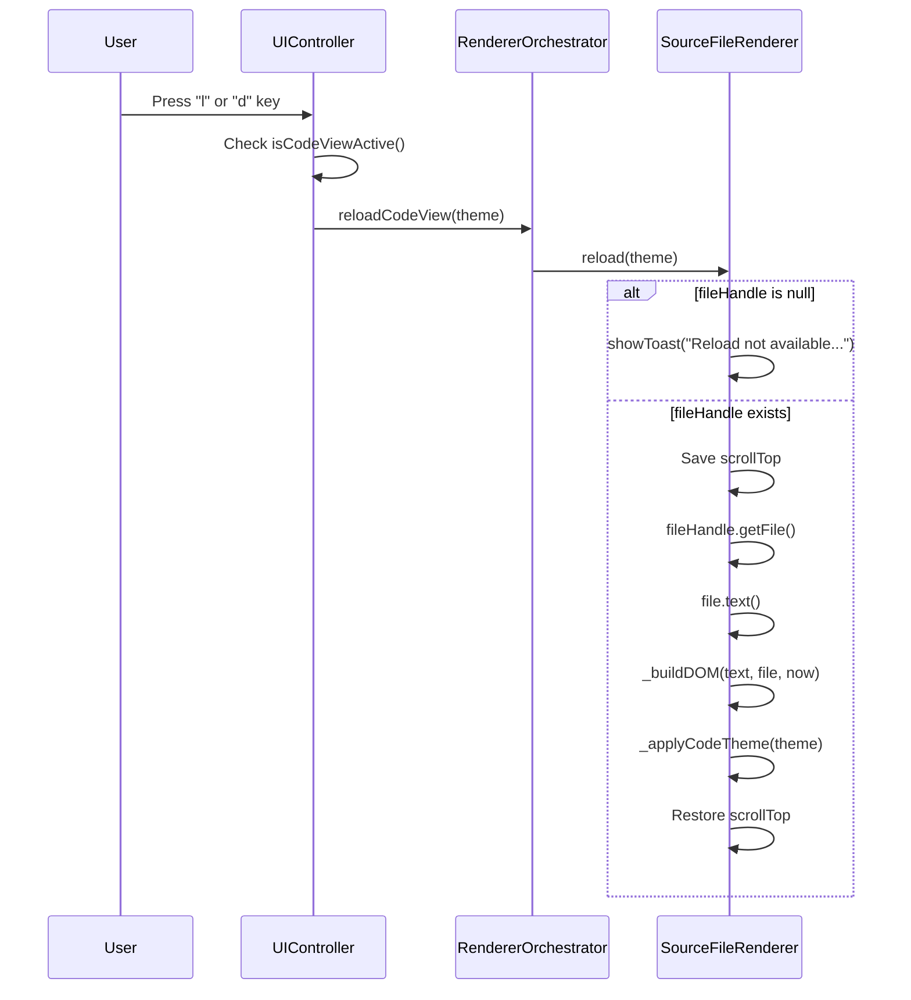
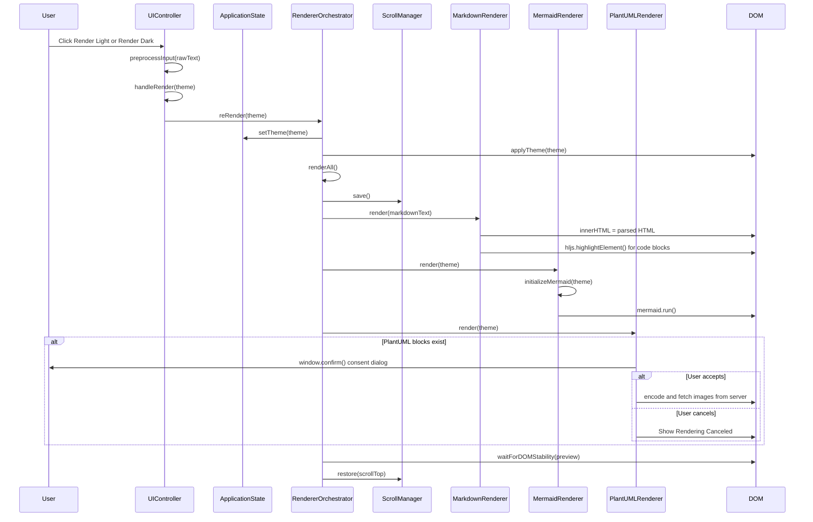
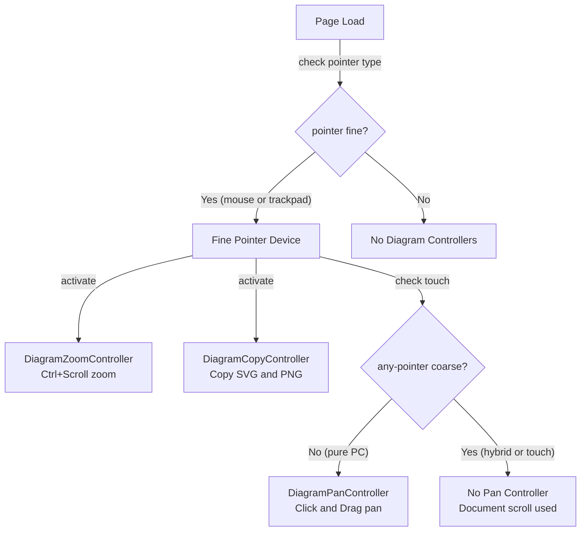
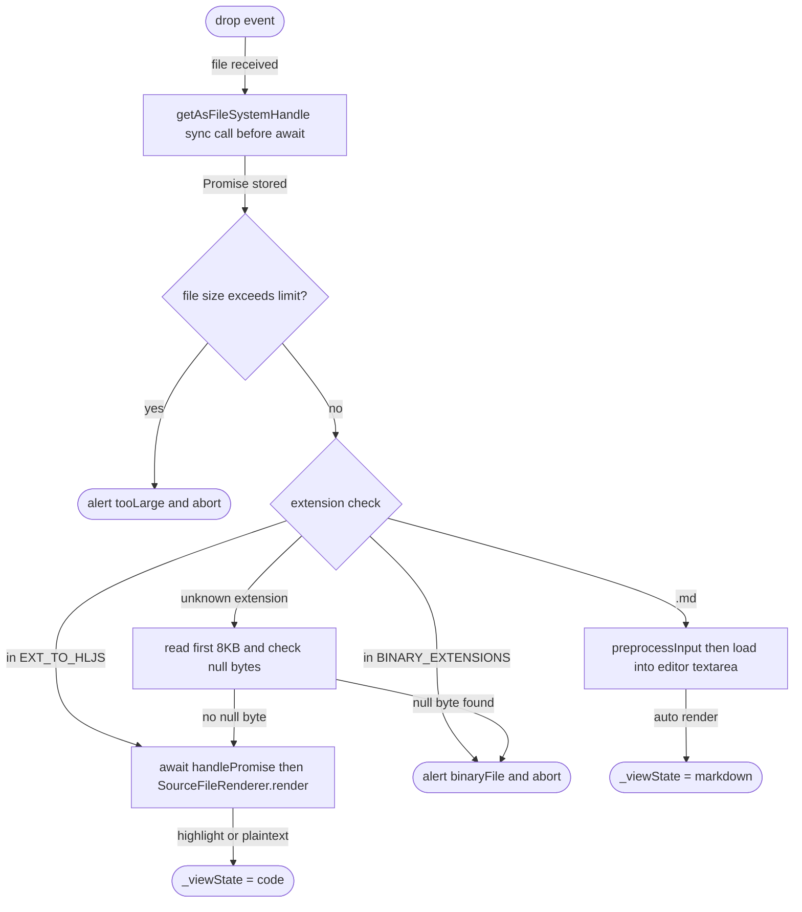

# GRSMD Gen2 ソフトウェア仕様書

**バージョン:** Gen2 v0.1
**日付:** 2026-03-04
**ステータス:** 統合仕様書 (Spec①②③ 統合 + レビュー反映)

---

## 目次

1. 基盤
   - 1.1 背景
   - 1.2 課題
   - 1.3 目標
   - 1.4 解決方針（ディレクトリ構成含む）
   - 1.5 スコープ
   - 1.6 制約事項
2. 不変要件 (EARS)
3. 構造設計
   - 3.1 コンポーネント図
   - 3.2 クラス図
   - 3.3 状態遷移図
   - 3.4 シーケンス図
   - 3.5 デバイス機能マトリクス
4. 機能シナリオ (Gherkin)
5. 実装仕様
   - 5.1 UI要素マップ
   - 5.2 CONFIG オブジェクト
   - 5.3 EXT\_TO\_HLJS マッピング
   - 5.4 ファイルドロップルーティング
   - 5.5 SourceFileRenderer
   - 5.6 SmoothScrollEngine
   - 5.7 ビュー状態管理
   - 5.8 カラーモード管理
   - 5.9 コードビュー UIレイアウトとCSS
   - 5.10 アフォーダンステキスト
   - 5.11 キーボードショートカット対応表
   - 5.12 ユーティリティ関数
   - 5.13 AI出力前処理 (preprocessInput)
   - 5.14 SW設計原則 準拠確認

付録 A: CDN依存ライブラリ

---

## 用語集

| 用語 | 定義 |
|------|------|
| GRSMD | GoodRelax Simple Markdown Renderer。単一ファイル (index.html) のクライアントサイド Markdown レンダラー＆ビューア。 |
| コードビュー (Code View) | 非.mdファイル用の表示モード。シンタックスハイライトと行番号付きでソースコードを表示する。正式名称: Quick Code View。 |
| Markdownプレビュー | 既存の表示モード。.mdファイルまたはペーストされたMarkdownテキストをmarked.js経由でHTMLとしてレンダリングする。 |
| プレレンダー状態 | アプリケーションの初期状態。エディタtextareaが空で、何もレンダリングされていない。`_viewState === 'initial'`。 |
| fileHandle | ドラッグ＆ドロップイベントから取得する FileSystemFileHandle インスタンス（Chrome/Edge 86+）。再ドロップなしにファイルリロードを可能にする。 |
| SourceFileRenderer | 新設JSクラス。コードビューのレンダリング全般を担当: シンタックスハイライト、行番号、ヘッダーバー、ステータスバー、キーボードヒント。 |
| SmoothScrollEngine | 新設JSクラス。requestAnimationFrame による速度＋摩擦モデルのキーボードスクロールアニメーション。 |
| ScrollManager | 既存クラス。Markdownの再レンダリング時にスクロール位置を保存・復元する。 |
| UIController | 既存クラス。すべてのUIイベント（キーボード、ドラッグ＆ドロップ、ボタン）を配線し、各レンダラーに委譲する。 |
| RendererOrchestrator | 既存クラス。レンダラーインスタンスを所有し、ビュー状態を管理し、レンダリングパイプラインを調整する。 |
| CONFIG | index.html 上部付近に宣言される中央集権的な設定オブジェクト。すべての調整可能な定数はここに集約する。 |
| EXT\_TO\_HLJS | ファイル拡張子から highlight.js 言語IDへのルックアップテーブル。 |
| \_viewState | RendererOrchestrator 内部の状態フラグ。列挙値: 'initial' / 'markdown' / 'code'。 |
| 速度＋摩擦モデル | スクロールの物理モデル。キー押下中は速度がmaxSpeedまで加速し、キー解放後はフレームごとの摩擦係数で速度が減衰する。物理パラメータの詳細は 5.6 を参照。 |
| トースト (Toast) | ビューポート下部に表示される、時間経過で自動消去される短い通知オーバーレイ。 |
| SRI | Subresource Integrity。CDNリソースが改ざんされていないことをハッシュ値で検証する仕組み。 |

---

## 1. 基盤

### 1.1 背景

開発者やテクニカルライターは、作業中にMarkdown、Mermaidダイアグラム、PlantUML、LaTeX数式のプレビューを頻繁に必要とする。既存のオンラインツールは大きく2つに分類される:

- **サーバーサイドレンダラー**（例: HackMD、StackEdit）: アカウント作成が必要で、ユーザーコンテンツを外部サーバーに送信する。機密文書には不適。
- **デスクトップアプリケーション**（例: Typora、VS Code拡張機能）: インストールと設定が必要。共有マシンやロックダウンされたマシンでは常に利用可能とは限らない。

ブラウザ上で完全に動作し、インストール不要で、ユーザーが明示的にオプトインしない限りコンテンツがデバイス外に出ないツールには、依然としてギャップがある。

加えて、Markdownドキュメントと並行してソースコードをレビューする開発者には、ツールを切り替えることなくシンタックスハイライト付きでコードを閲覧できる軽量な手段が必要である。キーボード駆動のナビゲーションも、効率的なコードレビューとドキュメント閲覧に不可欠である。

### 1.2 課題

| ID | 課題 |
|----|------|
| ISS-01 | オンラインMarkdownレンダラーはユーザーコンテンツをサーバーに送信するため、機密文書のプライバシー要件に違反する。 |
| ISS-02 | デスクトップツールはインストールと設定が必要であり、共有マシンや制限されたマシンでは障壁となる。 |
| ISS-03 | 多くのMarkdownプレビューアはMermaid、PlantUML、LaTeX数式を同時にサポートしていない。 |
| ISS-04 | PlantUMLは仕様上サーバーレンダリングが必要だが、ほとんどのツールはユーザーに外部通信の事実を通知しない。 |
| ISS-05 | Markdownと並行して、行番号付きのシンタックスハイライト済みソースコードを表示できる軽量ブラウザツールが存在しない。 |
| ISS-06 | キーボード駆動のワークフローへの対応が不十分。スクロールやテーマ切替にマウスが必須となっている。 |
| ISS-07 | .txtファイルが以前はMarkdownとして扱われていたが、プレーンテキストやログファイルとしては不正確である。 |

### 1.3 目標

| ID | 目標 |
|----|------|
| G-01 | **プライバシー優先**: ユーザーの明示的同意なしに、一切のデータを外部に送信しない。 |
| G-02 | **即時性**: ペーストまたはドロップから数秒以内にプレビューを表示する。 |
| G-03 | **ゼロインストール**: ブラウザを開くだけで利用可能。サーバー不要、プラグイン不要。 |
| G-04 | **単一ファイル配布**: 単一HTMLファイルで全機能を提供する。 |
| G-05 | **マルチフォーマット**: Markdown、Mermaid、PlantUML、LaTeX (KaTeX)、シンタックスハイライトを統一的にサポートする。 |
| G-06 | **Quick Code View**: 非.mdファイルに対し、行番号付きシンタックスハイライト対応コードビューを提供する。 |
| G-07 | **キーボードナビゲーション**: スムーススクロール（矢印キー）とショートカット（l/d/n/c）を両ビューで提供する。 |
| G-08 | **テーマ**: OS自動検出付きのライト/ダークテーマをサポートする。 |
| G-09 | **ライブリロード**: FileSystemFileHandle 経由でファイルシステムからソースファイルをリロードする（Chrome/Edge 86+）。 |

### 1.4 解決方針

**ランタイムスタック:**

| レイヤー | 技術 | 備考 |
|---------|------|------|
| 言語 | JavaScript (ES6+ クラス) | 当面TypeScriptは使用しない |
| ランタイム | ブラウザのみ（クライアントサイド SPA） | バックエンドなし、Node.jsなし |
| Markdownパーサー | marked.js v17.0.1 (UMD, CDN) | SRI保護あり |
| ダイアグラム描画 | Mermaid.js v11.12.2 (ESM, CDN) | クライアントサイドのみ |
| PlantUMLエンコード | plantuml-encoder v1.4.0 (ESM, CDN) | 同意付き外部サーバー通信 |
| シンタックスハイライト | highlight.js v11.11.1 (ESM, CDN) | Markdownコードブロックとコードビューの両方で使用 |
| 数式描画 | KaTeX v0.16.28 + marked-katex-extension v5.1.6 (CDN) | LaTeX数式サポート |

**ビルド戦略:**

| レイヤー | 技術 | 備考 |
|---------|------|------|
| 開発ビルド | Vite + vite-plugin-singlefile | マルチファイル開発、単一ファイルリリース |
| リリース成果物 | 単一HTMLファイル (docs/index.html) | CSS/JSはvite-plugin-singlefileでインライン化 |
| CDNインポート | 外部URLインポート | mermaid, hljs, katex等はCDNのまま |
| ホスティング | GitHub Pages | https://goodrelax.github.io/gr-simple-md-renderer/ |

**アーキテクチャ:** ES6クラスベースのSPA。Rendererパターン + Orchestratorによる協調制御。本番ではすべてのクラス、設定、スタイル、HTMLを単一ファイルに統合する。開発時はViteのマルチファイルソースを使用する。

**ディレクトリ構成:**

```
gr-simple-md-renderer/
├── src/                          # Vite source (multi-file dev)
│   ├── index.html                # HTML template (Vite entry)
│   ├── css/
│   │   └── style.css             # extracted from <style> block
│   └── js/
│       ├── main.js               # entry point + init block
│       ├── config.js             # CONFIG, EXT_TO_HLJS, FILE_SYSTEM_HANDLE_SUPPORTED
│       ├── utils.js              # utility functions (applyTheme, showToast, etc.)
│       └── classes/
│           ├── ApplicationState.js
│           ├── ScrollManager.js
│           ├── MarkdownRenderer.js
│           ├── DiagramRenderer.js
│           ├── MermaidRenderer.js
│           ├── PlantUMLRenderer.js
│           ├── SourceFileRenderer.js
│           ├── SmoothScrollEngine.js
│           ├── RendererOrchestrator.js
│           ├── ModalController.js
│           ├── UIController.js
│           ├── DiagramZoomController.js
│           ├── DiagramPanController.js
│           └── DiagramCopyController.js
├── docs/                         # GitHub Pages source (Vite build output)
│   ├── index.html                # single-file release (vite-plugin-singlefile)
│   ├── sample-data.md            # test sample (help modal links)
│   ├── sample-data.txt
│   ├── sample-data-2.md
│   └── sample-data-2.txt
├── spec/                         # specifications
│   └── grsmd_gen2_spec_ja.md
├── trial/                        # alpha/beta versions (manual, e.g. try1.html)
├── bat/                          # Windows launch helper scripts
├── py/                           # build / verify scripts
├── vite.config.js
├── package.json
├── CLAUDE.md
├── LICENSE
├── README.md
└── .gitignore
```

- GitHub Pages のソースディレクトリは `docs/` に設定する（URL変更なし）。
- `sample-data.*` は `docs/` に配置する。ヘルプモーダル内のリンクが相対パスで参照するため。
- クラスファイルに番号プレフィックスは付けない（例: `01_Foo.js` は不可）。
- CDN依存ライブラリ (mermaid, hljs, katex 等) は外部URLインポートのままとし、vite-plugin-singlefile でインライン化されるのはローカルの CSS/JS のみ。

### 1.5 スコープ

#### スコープ内

| ID | 機能 |
|----|------|
| SC-01 | Markdownレンダリング（marked.js）＋シンタックスハイライト |
| SC-02 | Mermaidダイアグラム描画（クライアントサイド） |
| SC-03 | PlantUMLレンダリング（必須のユーザー同意付き） |
| SC-04 | LaTeX数式レンダリング（KaTeX） |
| SC-05 | Quick Code View: 行番号付きシンタックスハイライト対応ソースビューア |
| SC-06 | キーボードナビゲーション: スムーススクロール（矢印）、テーマ（l/d）、クリア（c）、新規タブ（n） |
| SC-07 | FileSystemFileHandle ライブリロード（Chrome/Edge 86+） |
| SC-08 | OS自動検出付きライト/ダークテーマ |
| SC-09 | ファイルドラッグ＆ドロップ: .md → Markdown、その他 → コードビュー |
| SC-10 | クリップボードペースト自動レンダリング（Ctrl+V） |
| SC-11 | ダイアグラムズーム（Ctrl+スクロール、0.5x〜5.0x、PCのみ） |
| SC-12 | ダイアグラムパン（クリック＆ドラッグ、純粋PCのみ） |
| SC-13 | ダイアグラムコピー（SVG/PNGをクリップボードへ） |
| SC-14 | 印刷サポート（トップバー非表示、プレビュー表示） |
| SC-15 | マルチタブ対応（New Tabボタン） |
| SC-16 | ヘルプモーダル（英語/日本語バイリンガル） |
| SC-17 | MCBSMDプロンプトテンプレート（[?]長押し） |
| SC-18 | 再レンダリング時のスクロール位置保持 |
| SC-19 | AI出力前処理（マークダウンフェンス除去） |
| SC-20 | タッチデバイスレスポンシブレイアウト |
| SC-21 | プレレンダー状態のアフォーダンステキスト |

#### スコープ外

| ID | 除外機能 | 理由 |
|----|---------|------|
| OS-01 | バックエンド / サーバーサイド処理 | プライバシー優先原則 |
| OS-02 | ユーザーアカウント / 認証 | 設計上データ永続化なし |
| OS-03 | localStorage / sessionStorage / Cookie へのユーザーデータ保存 | プライバシー制約 (CON-03) |
| OS-04 | マルチタブ / マルチファイル編集 | YAGNI; 単一ファイルビューアのスコープ |
| OS-05 | コードビュー内ページ内検索 | YAGNI; ブラウザのCtrl+Fで十分 |
| OS-06 | コード編集 / 修正 | 読み取り専用ビューアであり、エディタではない |
| OS-07 | コンテンツによるファイルタイプ検出（マジックバイト全解析） | 先頭8KBのnullバイト検査で十分（5.4参照）。フルマジックバイト解析はYAGNI。 |
| OS-08 | TypeScript移行 | 将来のフェーズに延期 |
| OS-09 | プラグインシステム | YAGNI |
| OS-10 | 差分 / 比較ビュー | YAGNI |
| OS-11 | ファイル保存 / エクスポート（クリップボードコピー以外） | YAGNI |
| OS-12 | リアルタイムコラボレーション | スコープ外 |
| OS-13 | WYSIWYG Markdown編集 | スコープ外 |
| OS-14 | HTMLサニタイゼーション（DOMPurify） | marked.js のビルトインサニタイズに依存。ローカル使用前提のためDOMPurifyは不要と判断。リスク受容済み。 |
| OS-15 | オフラインPWA | スコープ外 |
| OS-16 | アクセシビリティ（ARIA、スクリーンリーダー対応） | 将来のフェーズに延期。現時点ではキーボードナビゲーションのみ対応。 |
| OS-17 | highlight.js 非common言語の個別インポート | YAGNIとする。common バンドル (約38言語) で十分。非common言語はplaintextまたはhighlightAutoフォールバック（5.3参照）。 |

### 1.6 制約事項

| ID | 制約 |
|----|------|
| CON-01 | `DataTransferItem.getAsFileSystemHandle()` はdropイベントハンドラ内で、最初の `await` よりも前に同期的に呼び出す必要がある。返されたPromiseは保存し、後でawaitする。 |
| CON-02 | highlight.js 11.11.1、marked.js 17.0.1、mermaid 11.12.2、plantuml-encoder 1.4.0、KaTeX 0.16.28、marked-katex-extension 5.1.6 のCDN URLおよびSRIハッシュは、検証なしに変更してはならない。 |
| CON-03 | ユーザーデータ（ファイル内容、ファイル名、メタデータ）をlocalStorage、sessionStorage、Cookieに保存してはならない。 |
| CON-04 | 既存のPlantUML同意ダイアログ（window.confirm）を削除またはバイパスしてはならない。 |
| CON-05 | 本番リリースは単一HTMLファイルでなければならない。マルチファイル構成は開発時（Viteソース）のみ許容され、リリース前に統合すること。 |
| CON-06 | すべてのソースコード、UIテキスト、コメント、インラインドキュメントはASCII英語のみとする。例外: (a) [?]ヘルプモーダルのコンテンツ（バイリンガル）、(b) PlantUML同意ダイアログ。 |
| CON-07 | 明示的な承認なしに新しいCDN依存を追加してはならない。 |
| CON-08 | 受け入れ可能な最大ファイルサイズはMarkdownパス・コードビューパスの両方で5 MBとする。 |
| CON-09 | JavaScriptはES6+クラスベースで記述すること。 |
| CON-10 | CDNライブラリのバージョン変更は機能検証を必須とする。 |
| CON-11 | バックエンドを追加してはならない（サーバー処理、APIエンドポイント、Node.jsサーバー一切不可）。 |
| CON-12 | PlantUML以外の外部サーバー通信を追加してはならない（PlantUMLはユーザー同意が前提）。 |

---

## 2. 不変要件 (EARS)

EARS (Easy Approach to Requirements Syntax) 形式: `<トリガー>の場合、システムは<応答>を行うこと。`

| ID | 種別 | 要件 |
|----|------|------|
| INV-01 | 常時 | システムはユーザーデータ（ファイル内容、ファイル名、メタデータ）をユーザーの明示的同意なく外部サーバーに送信してはならない。唯一の例外はPlantUMLダイアグラムデータであり、ダイアログでのユーザー確認後にのみ送信する。 |
| INV-02 | イベント駆動 | レンダリング中にPlantUMLコードブロックが検出された場合、システムはPlantUMLサーバーにデータを送信する前に確認ダイアログを表示すること。 |
| INV-03 | イベント駆動 | ユーザーがPlantUML同意ダイアログをキャンセルした場合、システムはサーバーにデータを送信せず、各PlantUMLブロックの代わりに「Rendering Canceled」を表示すること。 |
| INV-04 | 常時 | システムはユーザー入力をlocalStorage、sessionStorage、Cookieに保存してはならない。 |
| INV-05 | 常時 | システムはMarkdown、Mermaid、シンタックスハイライト、KaTeX数式をすべてクライアントサイドでレンダリングすること。 |
| INV-06 | 常時 | 本番成果物はすべてのCSS、JavaScript、HTMLをインラインに含む単一HTMLファイルとすること。 |
| INV-07 | 常時 | システムはすべてのCDNリソースをSubresource Integrity (SRI) ハッシュ付きでロードすること。 |
| INV-08 | 状態駆動 | プレレンダー状態（エディタ空、レンダリング済みコンテンツなし）において、ペーストまたはファイルドロップはシステムテーマで自動レンダリングをトリガーすること。 |
| INV-09 | イベント駆動 | レンダリングがトリガーされた場合、システムはレンダリングパイプライン完了後にスクロール位置を保存・復元すること。 |
| INV-10 | 異常系 | PlantUML画像が5秒以内にロードできなかった場合、システムはダイアグラムの代わりにタイムアウトエラー要素を表示すること。 |
| INV-11 | イベント駆動 | ファイルがドロップされた場合、システムはCONFIG.fileDrop.maxBytes (5 MB) に対してファイルサイズを検証し、超過ファイルはアラートで拒否すること。 |
| INV-12 | 常時 | システムは初回ページロード時およびクリア時にOSのカラースキーム設定（prefers-color-scheme）を適用すること。 |
| INV-13 | イベント駆動 | ユーザーが [Clear] ボタンまたは `c` キーを押した場合、システムはプレレンダー状態にリセットすること: エディタtextareaクリア、現在のビュー破棄、OSカラースキーム復元、アフォーダンステキスト表示。 |
| INV-14 | イベント駆動 | キーボードショートカットキー (l, d, n, c, ArrowUp, ArrowDown) がINPUTまたはTEXTAREA要素にフォーカスがある状態で押された場合、システムはそのキーイベントをインターセプトしないこと。 |
| INV-15 | 異常系 | ブラウザがFileSystemFileHandleをサポートしていない場合、システムはグレースフルデグレードすること: コードビューはファイルを通常通り表示し、ユーザーがリロードを試みた場合にのみトースト通知を表示する。 |
| INV-16 | 状態駆動 | デバイスが `pointer: fine` を持つ場合、ダイアグラムのズーム (DiagramZoomController) およびコピー (DiagramCopyController) をアクティブにすること。`pointer: fine` を持たないデバイスではこれらをインスタンス化しないこと。 |
| INV-16b | 状態駆動 | ダイアグラムのパンコントローラー (DiagramPanController) は、デバイスが `pointer: fine` を持ち、かつ `any-pointer: coarse` を持たない場合（純粋PC環境）にのみアクティブにすること。 |
| INV-17 | イベント駆動 | `.md` ファイルがドロップされた場合、システムはそれをMarkdownプレビューにルーティングすること。その際 `preprocessInput` を適用してからレンダリングすること。非`.md` ファイルについてはINV-18のファイル分類ルールに従いコードビューにルーティングすること。 |
| INV-18 | イベント駆動 | ファイルドロップ時の分類は以下の5段階で行うこと: (1) `.md` → Markdownプレビュー、(2) `EXT_TO_HLJS` に登録済み → コードビュー（ハイライト試行）、(3) `BINARY_EXTENSIONS` に該当 → アラートで拒否、(4) 上記いずれにも該当しない場合は先頭8KBを読みnullバイト検査 → nullバイトあり → アラートで拒否、(5) nullバイトなし → コードビュー（plaintext表示）。拡張子を擬態したファイル（登録済み拡張子だが中身がバイナリ等）に対しては特別な対処を行わず、そのまま表示を試みること。 |
| INV-18b | 状態駆動 | コードビューでキーボードスクロール中は、`.code-line:hover` によるハイライトを一時的に無効化すること（ちらつき防止）。 |

---

## 3. 構造設計

### 3.1 コンポーネント図

**GRSMDコンポーネントアーキテクチャ:**



UIControllerがユーザーイベントを受け取り、RendererOrchestratorに処理を委譲する。OrchestratorはMarkdown、Mermaid、PlantUMLのパイプラインを逐次実行し、スクロール位置を復元する。Diagram系コントローラ（Zoom/Pan/Copy）はpreview要素を監視し、レンダリング済みダイアグラムに作用する。SourceFileRendererとSmoothScrollEngineはMarkdownパイプラインとは独立してコードビューパスを処理する。

### 3.2 クラス図

**GRSMDクラス構造:**

```mermaid
classDiagram
    direction TB

    class ApplicationState {
        +currentTheme : string
        +markdownText : string
        +setTheme(theme) : void
        +setMarkdownText(text) : void
    }

    class ScrollManager {
        -container : HTMLElement
        -useDocumentScroll : boolean
        +save() : number
        +restore(pos) : void
    }

    class MarkdownRenderer {
        -preview : HTMLElement
        -marked : object
        -hljs : object
        +render(markdownText) : Promise
    }

    class DiagramRenderer {
        <<abstract>>
        +render(theme, skipRendering) : Promise
    }

    class MermaidRenderer {
        -preview : HTMLElement
        -mermaid : object
        +render(theme) : Promise
        -initializeMermaid(theme) : void
        -renderMermaid() : Promise
        -convertCodeBlockToContainer(block) : HTMLElement
    }

    class PlantUMLRenderer {
        -preview : HTMLElement
        -encoder : object
        +render(theme) : Promise
        -renderSingleBlock(block, theme) : Promise
        -applyTheme(code, theme) : string
        -createImage(code) : HTMLImageElement
        -createWrapper(img) : HTMLDivElement
        -waitForImageLoad(img, timeout) : Promise
        -createErrorElement(message) : HTMLDivElement
    }

    class SmoothScrollEngine {
        -_cfg : object
        -_velocity : number
        -_direction : number
        -_keyHeld : boolean
        -_rafId : number
        -_lastTs : number
        +startScroll(direction) : void
        +stopScroll() : void
        +destroy() : void
        -_loop(ts) : void
    }

    class SourceFileRenderer {
        -_cfg : object
        -_previewEl : HTMLElement
        -_fileHandle : FileSystemFileHandle
        -_fileName : string
        -_lastScrollTop : number
        -_keyHintTimer : number
        +render(file, fileHandle, theme) : Promise
        +reload(theme) : Promise
        +destroy() : void
        -_buildDOM(text, file, loadedAt) : string
        -_splitHighlightedLines(html) : string array
        -_applyCodeTheme(theme) : void
        -_scheduleKeyHintFade() : void
    }

    class RendererOrchestrator {
        -state : ApplicationState
        -markdownRenderer : MarkdownRenderer
        -mermaidRenderer : MermaidRenderer
        -plantumlRenderer : PlantUMLRenderer
        -scrollManager : ScrollManager
        -preview : HTMLElement
        -sourceFileRenderer : SourceFileRenderer
        -_viewState : string
        +isPreRenderState() : boolean
        +isCodeViewActive() : boolean
        +loadMarkdown(text, theme) : Promise
        +renderCodeView(file, fileHandle) : Promise
        +renderAll() : Promise
        +reRender(theme) : Promise
        +reloadCodeView(theme) : void
        +clear() : void
        -_hideAffordance() : void
        -_showAffordance() : void
    }

    class ModalController {
        <<static>>
        +setupModal(modal, closeTriggers)$ : void
        +show(modal)$ : void
        +hide(modal)$ : void
    }

    class DiagramZoomController {
        -preview : HTMLElement
        -scales : WeakMap
        -baseWidths : WeakMap
        -origMaxWidths : WeakMap
        +setupListeners() : void
        +findDiagramAt(target) : Element
        +zoom(el, direction) : void
        +resetZoom(el) : void
        +applyScale(el, scale) : void
    }

    class DiagramPanController {
        -preview : HTMLElement
        -panState : object
        +setupListeners() : void
        +findScrollContainerAt(target) : HTMLElement
        +setCursor(container, active) : void
    }

    class DiagramCopyController {
        -preview : HTMLElement
        -observer : MutationObserver
        +attachBars() : void
        +attachBar(container) : void
        +inlineSvgStyles(svg) : SVGSVGElement
        +convertForeignObjects(svgClone, svgOrig) : void
        +prepareSvg(svg) : SVGSVGElement
        +showFeedback(btn, msg, reset, ms) : void
        +copyAsSvg(container, btn) : Promise
        +copyAsPng(container, btn) : Promise
    }

    class UIController {
        -orchestrator : RendererOrchestrator
        -state : ApplicationState
        -elements : object
        -scrollEngine : SmoothScrollEngine
        -longPressTimer : number
        -isLongPress : boolean
        +setupEventListeners() : void
        +preprocessInput(rawText) : string
        +handleRender(theme) : void
        +doClear() : void
        +applyTheme(theme) : void
        +applySystemTheme() : void
        -setupRenderButtons() : void
        -setupUtilityButtons() : void
        -setupFileDrop() : void
        -setupAutoRenderOnPaste() : void
        -setupKeyboard() : void
        -setupHelpButton() : void
        -setupPromptButton() : void
        -setupModals() : void
        -setupPromptText() : void
    }

    DiagramRenderer <|-- MermaidRenderer : extends
    DiagramRenderer <|-- PlantUMLRenderer : extends
    UIController --> RendererOrchestrator : delegates to
    UIController --> ApplicationState : reads and writes
    UIController --> SmoothScrollEngine : scroll commands
    UIController --> ModalController : modal commands
    RendererOrchestrator --> ApplicationState : owns
    RendererOrchestrator --> MarkdownRenderer : owns
    RendererOrchestrator --> MermaidRenderer : owns
    RendererOrchestrator --> PlantUMLRenderer : owns
    RendererOrchestrator --> ScrollManager : owns
    RendererOrchestrator --> SourceFileRenderer : owns
    DiagramZoomController --> RendererOrchestrator : listens on preview
    DiagramPanController --> RendererOrchestrator : listens on preview
    DiagramCopyController --> RendererOrchestrator : listens on preview
```



### 3.3 状態遷移図

**アプリケーションビューステート (_viewState):**



任意の状態から `.md` ドロップまたはペーストで `markdown` へ、非`.md` ファイルドロップで `code` へ遷移可能。ただし、BINARY_EXTENSIONS に該当する拡張子、または未知の拡張子で先頭8KBにヌルバイトを含むファイルはアラートで拒否し、状態遷移は発生しない (INV-18)。

**テーマステート:**



### 3.4 シーケンス図

**Markdownペースト→レンダリングフロー:**



**コードビュー ファイルドロップフロー:**



**コードビュー リロードフロー (l/dキー):**



**完全レンダリングパイプライン（ボタンクリック）:**



### 3.5 デバイス機能マトリクス

**デバイス検出と機能アクティベーション:**



DiagramPanControllerは純粋なPC環境（fineポインターあり、かつcoarseポインターなし）でのみインスタンス化される。ハイブリッドデバイス（例: Surface）ではドキュメントスクロールとの競合を避けるためパンは無効化される。

## 4. 機能シナリオ (Gherkin)

### FS-01: Markdownレンダリング

```gherkin
Feature: Markdownレンダリング
  ユーザーとして
  Markdownテキストをペーストまたはドロップしてプレビューしたい
  ダイアグラム、数式、シンタックスハイライト付きで表示するために

  Scenario: プレレンダー状態でMarkdownテキストをペースト
    Given アプリケーションがプレレンダー状態である
    And エディタのテキストエリアが空である
    When ユーザーがクリップボードにMarkdownテキストがある状態でCtrl+Vを押す
    Then エディタのテキストエリアにペーストされたテキストが入力される
    And プレビューエリアにMarkdownがレンダリングされる
    And テーマがOSのカラースキーム設定に一致する
    And _viewStateが "markdown" になる

  Scenario: .mdファイルをドロップ
    Given アプリケーションが任意の状態である
    When ユーザーが .md ファイルをページにドロップする
    Then ファイル内容が読み取られる
    And プレビューエリアにMarkdownがレンダリングされる
    And _viewStateが "markdown" になる

  Scenario: ダークテーマでMarkdownを再レンダリング
    Given Markdownがレンダリング済みである (_viewStateが "markdown")
    When ユーザーが "d" キーを押す
    Then Markdownがダークテーマで再レンダリングされる
    And スクロール位置が保持される

  Scenario: ライトテーマでMarkdownを再レンダリング
    Given Markdownがレンダリング済みである (_viewStateが "markdown")
    When ユーザーが "l" キーを押す
    Then Markdownがライトテーマで再レンダリングされる
    And スクロール位置が保持される

  Scenario: コードビュー中に.mdファイルをドロップ
    Given コードビューがアクティブである (_viewStateが "code")
    When ユーザーが .md ファイルをページにドロップする
    Then コードビューが破棄される
    And ファイル内容がMarkdownプレビューにレンダリングされる
    And _viewStateが "markdown" になる

  Scenario: Markdownプレビュー中に非.mdファイルをドロップ
    Given Markdownがレンダリング済みである (_viewStateが "markdown")
    When ユーザーがサポート対象の非.mdファイルをドロップする
    Then Markdownプレビューがクリアされる
    And ファイルがコードビューで表示される
    And _viewStateが "code" になる

  Scenario: ライトテーマでレンダリング
    Given ユーザーがMarkdownテキストをエディタにペーストしている
    When ユーザーが Render Light ボタンをクリックする
    Then body要素に "dark" クラスが付与されていない
    And Markdownがパースされプレビューエリアに表示される
    And コードブロックにシンタックスハイライトが適用される
    And Mermaidダイアグラムがレンダリングされる

  Scenario: ダークテーマでレンダリング
    Given ユーザーがMarkdownテキストをエディタにペーストしている
    When ユーザーが Render Dark ボタンをクリックする
    Then body要素に "dark" クラスが付与される
    And MermaidがダークテーマでMermaidを初期化する
    And PlantUMLコードに "!theme cyborg" が注入される (未指定の場合)

  Scenario: レンダリング済みの状態でペースト
    Given プレビューエリアにレンダリング済みコンテンツがある
    When ユーザーがページ上でテキストをペーストする
    Then ブラウザのデフォルトペースト動作が行われる
    And 自動レンダリングは発生しない
```

### FS-02: PlantUML同意フロー

```gherkin
Feature: PlantUML同意フロー
  ユーザーとして
  PlantUMLのレンダリング前に同意を求められたい
  プライバシーを保護するために

  Scenario: PlantUMLレンダリングに同意する
    Given MarkdownにPlantUMLコードブロックが含まれている
    When レンダリングパイプラインがPlantUMLフェーズに到達する
    Then セキュリティ警告付きの確認ダイアログが表示される
    When ユーザーがOKをクリックする
    Then 各PlantUMLブロックがエンコードされPlantUMLサーバーに送信される
    And 結果のSVG画像がコードブロックを置き換える

  Scenario: PlantUMLレンダリングをキャンセル
    Given MarkdownにPlantUMLコードブロックが含まれている
    When レンダリングパイプラインがPlantUMLフェーズに到達する
    And ユーザーが同意ダイアログでキャンセルをクリックする
    Then PlantUMLサーバーにデータは送信されない
    And 各PlantUMLコードブロックに "Rendering Canceled" が表示される
    And 他のMarkdownおよびMermaidコンテンツはレンダリング済みのまま維持される

  Scenario: PlantUML画像のタイムアウト
    Given ユーザーがPlantUMLレンダリングに同意した
    When PlantUML画像が5000ms以内にロードされない
    Then 画像が "PlantUML timeout (5s)" エラー要素で置き換えられる
```

### FS-03: Quick Code View

```gherkin
Feature: Quick Code View
  開発者として
  任意のテキストファイルをドロップしてシンタックスハイライト付きで表示したい
  行番号付きでソースコードを読むために

  Scenario: Pythonファイルをドロップ
    Given アプリケーションがプレレンダー状態である
    When ユーザーが .py ファイルをページにドロップする
    Then ファイルがコードビューで表示される
    And Python用のシンタックスハイライトが適用される
    And 行番号が表示される
    And スティッキーヘッダーに "[CODE VIEW] filename.py | timestamp | size" が表示される
    And 固定ステータスバーにファイルメタデータが表示される
    And テーマがダークモードに強制される
    And _viewStateが "code" になる

  Scenario: .txtファイルをドロップ
    Given アプリケーションが任意の状態である
    When ユーザーが .txt ファイルをページにドロップする
    Then ファイルがコードビューで表示される (Markdownプレビューではない)
    And コンテンツが行番号付きプレーンテキストとして表示される

  Scenario: 未知拡張子のテキストファイルをドロップ (INV-18 段階4-5)
    Given アプリケーションが任意の状態である
    When ユーザーがEXT_TO_HLJSに未登録の拡張子 ".env" のテキストファイルをドロップする
    Then 先頭8KBのnullバイト検査が実行される
    And nullバイトがないためコードビューでplaintext表示される

  Scenario: バイナリ拡張子のファイルをドロップ (INV-18 段階3)
    Given アプリケーションが任意の状態である
    When ユーザーが ".exe" ファイルをドロップする
    Then アラートに "This file appears to be binary and cannot be displayed." が表示される
    And ファイルは処理されない

  Scenario: 未知拡張子のバイナリファイルをドロップ (INV-18 段階4)
    Given アプリケーションが任意の状態である
    When ユーザーがEXT_TO_HLJSに未登録かつBINARY_EXTENSIONSにも未登録の拡張子のバイナリファイルをドロップする
    Then 先頭8KBのnullバイト検査でnullバイトが検出される
    And アラートに "This file appears to be binary and cannot be displayed." が表示される

  Scenario: 拡張子なしファイル (Dockerfile等) をドロップ
    Given アプリケーションが任意の状態である
    When ユーザーが "Dockerfile" をドロップする
    Then EXT_TO_HLJSのファイル名ルックアップで言語が解決される
    And ファイルがコードビューで表示される (hljs commonに含まれない言語はhighlightAutoフォールバック)

  Scenario: 初回コードビュー読み込み時のキーボードヒント
    Given 非.mdファイルがドロップされた直後である
    When コードビューが表示される
    Then 画面下部にキーボードヒントオーバーレイが表示される
    And 3000ms後にヒントがフェードアウトしDOMから削除される
```

### FS-04: コードビューリロード

```gherkin
Feature: コードビューリロード
  外部でファイルを編集する開発者として
  再ドロップせずにGRSMDでファイルをリロードしたい
  最新の変更を確認するために

  Scenario: FileSystemFileHandleサポートありでリロード
    Given fileHandleを持つファイルでコードビューがアクティブである
    When ユーザーが "l" キーを押す
    Then fileHandle.getFile() 経由でファイルがディスクから再読み取りされる
    And コンテンツがライトテーマで再ハイライトされる
    And スクロール位置が保持される
    And ヘッダーのタイムスタンプとステータスバーが更新される

  Scenario: FileSystemFileHandleサポートなしでリロード
    Given コードビューがアクティブだがfileHandleがnullである
    When ユーザーが "d" キーを押す
    Then トーストに "Reload not available (Chrome/Edge 86+ required)" が表示される
    And トーストが3000ms後に消える
    And 現在のビューは変更されない
```

### FS-05: キーボードナビゲーション

```gherkin
Feature: キーボードナビゲーション
  ユーザーとして
  キーボードショートカットを使いたい
  マウスなしで効率的にナビゲートするために

  Scenario: Markdownプレビューでの下方向スムーススクロール
    Given Markdownがレンダリング済みである (_viewStateが "markdown")
    And フォーカスがINPUTまたはTEXTAREAにない
    When ユーザーがArrowDownキーを押し続ける
    Then ページが加速しながら下方向にスクロールする
    And キーが離されるとスクロールが摩擦で減速する
    And 速度が0.005 px/msを下回るとスクロールが停止する

  Scenario: コードビューでのスムーススクロール
    Given コードビューがアクティブである (_viewStateが "code")
    When ユーザーがArrowUpを押す
    Then ページが上方向にスムーズにスクロールする

  Scenario: プレレンダー状態での矢印キー
    Given _viewStateが "initial" である
    When ユーザーがArrowDownを押す
    Then 何も起こらない (スクロールもエラーもなし)

  Scenario: エディタ入力中のキーボードショートカット
    Given フォーカスがエディタのテキストエリアにある
    When ユーザーが "l" を入力する
    Then 文字 "l" がテキストエリアに挿入される
    And テーマ切替は発生しない
```

### FS-06: テーマ管理

```gherkin
Feature: テーマ管理
  ユーザーとして
  アプリがOSのテーマ設定を尊重しつつ手動オーバーライドもできるようにしたい

  Scenario: 初回読み込みがOS設定に従う
    Given ユーザーのOSがダークモードに設定されている
    When GRSMDページが読み込まれる
    Then bodyに class "dark" が設定される

  Scenario: コードビューが初回読み込みでダークを強制
    Given ユーザーのOSがライトモードに設定されている
    When ユーザーが .py ファイルをドロップする
    Then コードビューがダークモードで表示される
    And bodyに class "dark" が設定される

  Scenario: クリアでOS設定に復元
    Given ダークモードでコードビューがアクティブである
    And ユーザーのOSがライトモードに設定されている
    When ユーザーが "c" を押す
    Then テーマがライトモード (OS設定) に戻る

  Scenario: ダークテーマがMermaidに影響
    Given ユーザーがRender Darkをクリックした
    When Mermaidダイアグラムがレンダリングされる
    Then MermaidがダークテーマでMermaidを初期化する

  Scenario: ダークテーマがPlantUMLに影響
    Given ユーザーがRender Darkをクリックした
    And PlantUMLコードに "!theme" ディレクティブが含まれていない
    When PlantUMLブロックがレンダリングされる
    Then PlantUMLコードに "!theme cyborg" が注入される
```

### FS-07: クリアとリセット

```gherkin
Feature: クリアとリセット
  ユーザーとして
  アプリを初期状態にリセットしたい
  新しいファイルで作業を始めるために

  Scenario: Markdownプレビューからクリア
    Given プレビューにレンダリング済みコンテンツがある (_viewStateが "markdown")
    When ユーザーがClearボタンをクリックする
    Then エディタのテキストエリアが空になる
    And プレビューエリアがクリアされる
    And OSのカラースキーム設定が再適用される
    And アフォーダンステキストが表示される
    And _viewStateが "initial" になる

  Scenario: コードビューからクリア
    Given コードビューがアクティブである (_viewStateが "code")
    When ユーザーが "c" を押す
    Then コードビューが破棄される (sourceFileRenderer.destroy())
    And エディタのテキストエリアがクリアされる
    And アフォーダンステキストが表示される
    And テーマがOS設定に戻る
    And _viewStateが "initial" になる
```

### FS-08: 新規タブ

```gherkin
Feature: 新規タブ
  ユーザーとして
  GRSMDを新しいタブで開きたい
  並行して作業するために

  Scenario: 任意の状態から新規タブ
    Given アプリケーションが任意の状態である
    When ユーザーが "n" を押すかNew Tabボタンをクリックする
    Then 同じURLで新しいブラウザタブが開く
    And 現在のタブの状態は変更されない
```

### FS-09: ダイアグラムインタラクション (Fine Pointer デバイス)

```gherkin
Feature: ダイアグラムインタラクション (Fine Pointer デバイス)
  マウスまたはトラックパッドを持つユーザーとして
  ダイアグラムのズーム、パン、コピーをしたい
  詳細を確認するために

  Scenario: Mermaidダイアグラムをズームイン
    Given Mermaidダイアグラムがレンダリング済みである
    And デバイスがpointer:fineを持つ
    When ユーザーがダイアグラム上でCtrl+上スクロールする
    Then ダイアグラムのSVG幅がベース幅の10%分拡大する
    And ズーム倍率が0.5xから5.0xの間にクランプされる

  Scenario: ダブルクリックでズームリセット
    Given ダイアグラムが2.0xにズームされている
    When ユーザーがダイアグラムをダブルクリックする
    Then ダイアグラムが1.0x (元のサイズ) に戻る

  Scenario: ズームされたダイアグラムをパン
    Given ダイアグラムがコンテナを超えてズームされている
    And デバイスがpointer:fineを持ちany-pointer:coarseでない
    When ユーザーが5px以上クリックアンドドラッグする
    Then ダイアグラムコンテナがドラッグに追従してスクロールする
    And カーソルが "grabbing" に変わる

  Scenario: MermaidダイアグラムをPNGとしてコピー
    Given Mermaidダイアグラムがレンダリング済みである
    When ユーザーが "Copy PNG" ボタンをクリックする
    Then SVGが2xキャンバスにレンダリングされる
    And PNGブロブがクリップボードにコピーされる
    And ボタンが250ms間 "Copied!" フィードバックを表示する

  Scenario: MermaidダイアグラムをSVGとしてコピー
    Given Mermaidダイアグラムがレンダリング済みである
    When ユーザーが "Copy SVG" ボタンをクリックする
    Then SVGがインラインスタイル付きでクローンされる
    And foreignObject要素がtext要素に変換される
    And シリアライズされたSVGがクリップボードにコピーされる

  Scenario: PlantUMLダイアグラムをコピー
    Given PlantUMLダイアグラムがレンダリング済みである
    When ユーザーが "Copy SVG" をクリックする
    Then PlantUMLサーバーの /svg/ エンドポイントからSVGがフェッチされる
    And SVGテキストがクリップボードにコピーされる

  Scenario: Fine Pointerを持たないデバイスではズーム・パン・コピーなし
    Given デバイスが pointer:fine を持たない
    Then DiagramZoomControllerはインスタンス化されない
    And DiagramPanControllerはインスタンス化されない
    And DiagramCopyControllerはインスタンス化されない
```

### FS-10: ヘルプモーダル

```gherkin
Feature: ヘルプモーダル
  ユーザーとして
  使い方の説明を確認したい

  Scenario: ヘルプモーダルを表示
    Given アプリが実行中である
    When ユーザーが[?]ボタンを短くクリックする (押下時間 < 300ms)
    Then ヘルプモーダルが表示される
    And 英語と日本語のセクションが含まれる
    And サンプルデータリンクが含まれる

  Scenario: ヘルプモーダルを閉じる
    Given ヘルプモーダルが開いている
    When ユーザーが閉じるボタンまたは背景をクリックする
    Then ヘルプモーダルが非表示になる
```

### FS-11: MCBSMDプロンプトテンプレート

```gherkin
Feature: MCBSMDプロンプトテンプレート
  ユーザーとして
  MCBSMDフォーマットガイドをすぐにコピーしたい

  Scenario: 長押しでプロンプトモーダルを表示
    Given アプリが実行中である
    When ユーザーが[?]ボタンを長押しする (押下時間 >= 300ms)
    Then プロンプトモーダルが表示される
    And MCBSMDフォーマットガイドが含まれる

  Scenario: プロンプトテンプレートをコピー
    Given プロンプトモーダルが開いている
    When ユーザーがCopy to Clipboardボタンをクリックする
    Then MCBSMDテンプレートテキストがクリップボードにコピーされる
    And ボタンが一時的に "Copied!" を表示する
    And モーダルが250ms後に自動で閉じる
```

### FS-12: AI出力前処理

```gherkin
Feature: AI出力前処理
  ユーザーとして
  AIが生成したマークダウンフェンスを自動除去してほしい
  そのままレンダリングするために

  Scenario: マークダウンコードフェンスで囲まれた入力
    Given エディタに "```markdown" で始まり "```" で終わるテキストがある
    When レンダリングがトリガーされる
    Then 外側のマークダウンフェンスがパース前に除去される
    And 内側のMarkdownコンテンツが正常にレンダリングされる
```

### FS-13: ファイルサイズ検証

```gherkin
Feature: ファイルサイズ検証
  システムとして
  大きすぎるファイルを拒否したい
  パフォーマンスを維持するために

  Scenario: 5MBを超えるファイルをドロップ
    Given 任意のアプリケーション状態
    When ユーザーが5MBを超えるファイルをドロップする
    Then アラートに "Dropped file is too large. Maximum file size is 5 MB." が表示される
    And ファイルは処理されない

  Scenario: BINARY_EXTENSIONSに該当するファイルをドロップ
    Given 任意のアプリケーション状態
    When ユーザーが .exe / .png 等 BINARY_EXTENSIONS に含まれる拡張子のファイルをドロップする
    Then アラートに "Binary file is not supported." が表示される
    And ファイルは処理されない
    And アプリケーション状態は変更されない

  Scenario: 未知の拡張子でヌルバイトを含むファイルをドロップ
    Given 任意のアプリケーション状態
    When ユーザーが未知の拡張子のファイルをドロップし先頭8KBにヌルバイトが検出される
    Then アラートに "Binary file is not supported." が表示される
    And ファイルは処理されない

  Scenario: 未知の拡張子でテキストファイルをドロップ
    Given 任意のアプリケーション状態
    When ユーザーが未知の拡張子のファイルをドロップし先頭8KBにヌルバイトがない
    Then ファイルがコードビューでプレーンテキストとして表示される

  Scenario: 拡張子を擬態したファイルをドロップ
    Given 任意のアプリケーション状態
    When ユーザーがEXT_TO_HLJSに登録済みの拡張子だが中身がバイナリのファイルをドロップする
    Then システムは特別な検出を行わずそのままコードビューで表示を試みる
```

### FS-14: 印刷サポート

```gherkin
Feature: 印刷サポート
  ユーザーとして
  レンダリング結果を印刷したい

  Scenario: ページを印刷する
    When ユーザーが印刷をトリガーする (Ctrl+P)
    Then トップバーが非表示になる
    And エディタのテキストエリアが非表示になる
    And プレビューが自動高さで完全に表示される
```

### FS-15: タッチデバイスレイアウト

```gherkin
Feature: タッチデバイスレイアウト
  タッチデバイスのユーザーとして
  レスポンシブなレイアウトで使いたい

  Scenario: タッチデバイス向けレイアウト適用
    Given デバイスが "(any-pointer: coarse)" をtrueと報告する
    Then bodyが自動高さとvisibleオーバーフローを使用する
    And トップバーが上部にstickyとなる
    And プレビューがvisibleオーバーフローを使用する
    And ScrollManagerがwindow.scrollYで位置を追跡する
```

---

## 5. 実装仕様

### 5.1 UI要素マップ

#### 既存要素 (ID変更不可)

| 要素ID | タグ | 説明 |
|--------|------|------|
| `topbar` | div | エディタとコントロールを含む固定トップバー |
| `header-group` | div | タイトル＋著作権ラッパー |
| `title` | div | アプリケーションタイトルテキスト |
| `copyright` | div | GitHub リンク付き著作権表示 |
| `editor` | textarea | Markdown 入力エリア。`placeholder="Paste Markdown..."` |
| `controls` | div | ボタングループコンテナ |
| `renderLight` | button | ラベル: "Render Light" — 両ビュー共用 (FR-06) |
| `renderDark` | button | ラベル: "Render Dark" — 両ビュー共用 (FR-06) |
| `newTabBtn` | button | GRSMDを新しいブラウザタブで開く |
| `clearBtn` | button | エディタをクリアしプレレンダー状態にリセット |
| `helpBtn` | button | ヘルプモーダルを開く (ラベル: "?") |
| `preview` | div | メインコンテンツエリア: Markdownプレビュー / コードビュー / アフォーダンステキスト |
| `helpModal` | div | ヘルプダイアログモーダル |
| `promptModal` | div | MCBSMDプロンプトテンプレートオーバーレイ |
| `promptText` | textarea | 読み取り専用MCBSMDテンプレートテキスト |
| `copyPromptBtn` | button | プロンプトをクリップボードにコピー |

#### 新規要素 (Gen2で追加)

| 要素ID | タグ | 説明 |
|--------|------|------|
| `affordanceText` | div | `_viewState === 'initial'` 時に `#preview` 内に表示されるデフォルトヒントテキスト |
| `codeViewHeader` | div | `#preview` 内のスティッキーヘッダー: `[CODE VIEW] filename | timestamp | size` |
| `codeViewBody` | div | ハイライト済みコード＋行番号のスクロール可能領域 |
| `codeViewStatusBar` | div | 固定ボトムバー: ファイル名、行数、サイズ、読み込み時刻 |
| `codeViewKeyHint` | div | キーボードショートカットヒントオーバーレイ。`CONFIG.codeView.keyHintDurationMs` 後にフェードアウト |
| `toastContainer` | div | トースト通知用の固定コンテナ (ビューポート下部中央) |

### 5.2 CONFIG オブジェクト

**CONFIG 定義:**

```javascript
const CONFIG = {
  rendering: {
    stabilityTimeout: 1000,    // DOM stability wait timeout (ms)
    stabilityDebounce: 50,     // ResizeObserver debounce (ms)
  },
  plantuml: {
    imageLoadTimeout: 5000,    // Image load timeout (ms)
    serverUrl: "https://www.plantuml.com/plantuml/svg/",
    darkTheme: "cyborg",
  },
  ui: {
    longPressDuration: 300,    // Long-press detection threshold (ms)
    copyFeedbackDuration: 250, // "Copied!" feedback display time (ms)
    maxTextSelection: 99999,   // execCommand fallback selection range
  },
  zoom: {
    min: 0.5,
    max: 5.0,
    step: 0.1,
  },
  pan: {
    activationThresholdPx: 5,
  },
  // Updated: .txt removed from markdown path
  fileDrop: {
    markdownExtensions: [".md"],
    maxBytes: 5 * 1024 * 1024, // 5 MB
    messages: {
      tooLarge: "Dropped file is too large. Maximum file size is 5 MB.",
      unsupportedType: "Unsupported file type.",
      binaryFile: "Binary file is not supported.",
      readError: "Failed to read the dropped file.",
    },
  },
  // Smooth scroll physics parameters (tuned via poc/smooth-scroll-poc.html)
  // All values are configurable constants; adjust and re-test if feel is wrong.
  scroll: {
    maxSpeed: 0.50,      // px/ms  (peak scroll speed while key held)
    acceleration: 0.0010, // px/ms^2 (ramp-up rate)
    friction: 0.50,       // velocity multiplier per 60fps frame (lower = faster stop)
  },
  // New: Code View behavior settings
  codeView: {
    defaultTheme: "dark",
    keyHintDurationMs: 3000,
    toastDurationMs: 3000,
    reloadUnavailableMsg: "Reload not available (Chrome/Edge 86+ required)",
  },
  messages: {
    plantuml: {
      canceled: "Rendering Canceled",
      encodingFailed: "PlantUML encoding failed",
      timeout: (seconds) => `PlantUML timeout (${seconds}s)`,
      serverError: "PlantUML server error",
    },
    copy: {
      failed: "Copy failed.",
      blocked: "Browser denied copy.",
    },
  },
};
```

CONFIGはすべてのマジックナンバーとユーザー向けメッセージを集約する。変更はこのオブジェクトに局所化され、影響範囲を最小化する。

### 5.3 EXT\_TO\_HLJS マッピング

以下のすべての言語IDは highlight.js 11.11.1 に対して定義済み。ただし、GRSMDはCDNのESM **commonバンドル** (`highlight.min.js`) を使用しており、約38言語のみが同梱されている。commonバンドルに含まれない言語 (scala, powershell, elixir, erlang, haskell, clojure, dart, groovy, vim, latex, protobuf, dockerfile) は `hljs.highlight()` が失敗し、`hljs.highlightAuto()` にフォールバックする。自動検出も失敗した場合、コンテンツはエラーなしにプレーンテキストとして表示される。非common言語の個別インポートはYAGNIとする (OS-17)。

`EXT_TO_HLJS` はシンタックスハイライト対象の定義テーブルとして機能する。ファイル受け入れ判定には `BINARY_EXTENSIONS` ブラックリストとnullバイト検査を併用する (INV-18)。

**EXT\_TO\_HLJS 定義:**

```javascript
const EXT_TO_HLJS = {
  // Python
  ".py": "python", ".pyw": "python",
  // JavaScript / TypeScript
  ".js": "javascript", ".mjs": "javascript", ".cjs": "javascript",
  ".jsx": "javascript", ".ts": "typescript", ".tsx": "typescript",
  // C / C++
  ".c": "c", ".h": "c",
  ".cpp": "cpp", ".cc": "cpp", ".cxx": "cpp", ".hpp": "cpp", ".hxx": "cpp",
  // C# / Java
  ".cs": "csharp", ".java": "java",
  // Go / Rust / Swift / Kotlin / Scala
  ".go": "go", ".rs": "rust", ".swift": "swift",
  ".kt": "kotlin", ".kts": "kotlin", ".scala": "scala",
  // Ruby / PHP / Perl
  ".rb": "ruby", ".php": "php", ".pl": "perl", ".pm": "perl",
  // Shell / PowerShell
  ".sh": "bash", ".bash": "bash", ".zsh": "bash", ".fish": "bash",
  ".ps1": "powershell", ".psm1": "powershell",
  // Data / Config
  ".json": "json", ".jsonc": "json",
  ".xml": "xml", ".svg": "xml", ".html": "xml", ".htm": "xml",
  ".yaml": "yaml", ".yml": "yaml",
  ".toml": "ini", ".ini": "ini", ".cfg": "ini", ".conf": "ini",
  // Web styles
  ".css": "css", ".scss": "scss", ".sass": "scss", ".less": "less",
  // Database
  ".sql": "sql",
  // Functional / System / Other
  ".r": "r", ".R": "r", ".lua": "lua",
  ".ex": "elixir", ".exs": "elixir", ".erl": "erlang", ".hrl": "erlang",
  ".hs": "haskell", ".lhs": "haskell",
  ".clj": "clojure", ".cljs": "clojure",
  ".dart": "dart", ".groovy": "groovy", ".gradle": "groovy",
  ".vim": "vim", ".tex": "latex",
  ".diff": "diff", ".patch": "diff",
  ".proto": "protobuf", ".graphql": "graphql", ".gql": "graphql",
  // Plain text (no color)
  ".txt": "plaintext", ".log": "plaintext",
  ".csv": "plaintext", ".tsv": "plaintext",
  ".md": "markdown", // Note: .md is routed to Markdown Preview; listed for completeness
  // Extensionless files (matched by filename)
  "Dockerfile": "dockerfile",
  "Makefile": "makefile",
  "GNUmakefile": "makefile",
};
```

**\_buildDOM での拡張子検出:**

```javascript
const ext = fileName.includes(".")
  ? fileName.slice(fileName.lastIndexOf(".")).toLowerCase()
  : "";
const lang = EXT_TO_HLJS[ext] ?? EXT_TO_HLJS[fileName] ?? null;
```

2番目のルックアップ (`EXT_TO_HLJS[fileName]`) は `Dockerfile` のような拡張子なしファイルを処理する。

### 5.4 ファイルドロップルーティング

**ファイルドロップルーティング フローチャート:**



**BINARY\_EXTENSIONS 定義:**

```javascript
const BINARY_EXTENSIONS = new Set([
  // Images
  ".png", ".jpg", ".jpeg", ".gif", ".bmp", ".ico", ".webp", ".tiff", ".psd",
  // Audio
  ".mp3", ".wav", ".ogg", ".flac", ".aac", ".wma",
  // Video
  ".mp4", ".avi", ".mkv", ".mov", ".wmv", ".webm",
  // Archives
  ".zip", ".rar", ".7z", ".tar", ".gz", ".bz2", ".xz",
  // Executables / libraries
  ".exe", ".dll", ".so", ".dylib", ".msi", ".bin",
  // Documents (binary format)
  ".pdf", ".doc", ".docx", ".xls", ".xlsx", ".ppt", ".pptx",
  // Compiled / intermediate
  ".class", ".pyc", ".o", ".obj", ".wasm",
]);
```

**FileSystemFileHandle サポート確認 (起動時に1回実行):**

```javascript
const FILE_SYSTEM_HANDLE_SUPPORTED =
  typeof DataTransferItem !== "undefined" &&
  typeof DataTransferItem.prototype.getAsFileSystemHandle === "function";
```

**ドロップハンドラ スケルトン (CON-01 準拠, INV-18 5段階分類):**

```javascript
document.addEventListener("drop", async (e) => {
  e.preventDefault();
  const item = e.dataTransfer.items?.[0];

  // Synchronous call before any await (CON-01)
  const handlePromise = FILE_SYSTEM_HANDLE_SUPPORTED
    ? item?.getAsFileSystemHandle?.()
    : null;

  const file = e.dataTransfer.files[0];
  if (!file) return;
  if (file.size > CONFIG.fileDrop.maxBytes) {
    alert(CONFIG.fileDrop.messages.tooLarge);
    return;
  }

  const ext = file.name.includes(".")
    ? file.name.slice(file.name.lastIndexOf(".")).toLowerCase()
    : "";

  if (CONFIG.fileDrop.markdownExtensions.includes(ext)) {
    // (1) .md -> Markdown Preview (with preprocessInput)
    const text = this.preprocessInput(await file.text());
    this.elements.editor.value = text;
    orchestrator.loadMarkdown(text, systemTheme());
  } else if (EXT_TO_HLJS[ext] || EXT_TO_HLJS[file.name]) {
    // (2) Known text extension -> Code View (highlight attempt)
    const fileHandle = handlePromise ? await handlePromise : null;
    orchestrator.renderCodeView(file, fileHandle);
  } else if (BINARY_EXTENSIONS.has(ext)) {
    // (3) Known binary extension -> reject
    alert(CONFIG.fileDrop.messages.binaryFile);
  } else {
    // (4)/(5) Unknown extension -> null byte check on first 8KB
    const slice = file.slice(0, 8192);
    const bytes = new Uint8Array(await slice.arrayBuffer());
    if (bytes.some(b => b === 0)) {
      alert(CONFIG.fileDrop.messages.binaryFile);
      return;
    }
    // Text file with unknown extension -> Code View (plaintext)
    const fileHandle = handlePromise ? await handlePromise : null;
    orchestrator.renderCodeView(file, fileHandle);
  }
});
```

### 5.5 SourceFileRenderer

**クラススケルトン:**

```javascript
class SourceFileRenderer {
  constructor(config, previewEl) {
    this._cfg = config;
    this._previewEl = previewEl;
    this._fileHandle = null;
    this._fileName = "";
    this._lastScrollTop = 0;
    this._keyHintTimer = null;
  }

  async render(file, fileHandle, theme) {
    this._fileHandle = fileHandle;
    this._fileName = file.name;
    this._lastScrollTop = 0;
    const text = await file.text();
    const html = this._buildDOM(text, file, new Date());
    this._previewEl.innerHTML = html;
    this._applyCodeTheme(theme);
    this._scheduleKeyHintFade();
  }

  async reload(theme) {
    if (!this._fileHandle) {
      showToast(this._cfg.codeView.reloadUnavailableMsg,
                this._cfg.codeView.toastDurationMs);
      return;
    }
    this._lastScrollTop = window.scrollY;
    const file = await this._fileHandle.getFile();
    const text = await file.text();
    const html = this._buildDOM(text, file, new Date());
    this._previewEl.innerHTML = html;
    this._applyCodeTheme(theme);
    window.scrollTo(0, this._lastScrollTop);
  }

  destroy() {
    clearTimeout(this._keyHintTimer);
    this._previewEl.innerHTML = "";
    this._fileHandle = null;
    this._fileName = "";
    this._lastScrollTop = 0;
  }
}
```

**\_buildDOM(text, file, loadedAt) アルゴリズム:**

1. 拡張子を抽出: `fileName.slice(fileName.lastIndexOf('.')).toLowerCase()`
2. 言語を解決: `EXT_TO_HLJS[ext] ?? EXT_TO_HLJS[fileName] ?? null`
3. ハイライト: 既知の言語は `hljs.highlight(text, { language: lang })` を使用、未知は `hljs.highlightAuto(text)` を使用
4. ハイライト済みHTMLを行に分割し、各行を `<span class="code-line">` で囲む。行境界をまたぐspanタグは閉じて再度開く処理を行う。
5. タイムスタンプを生成: `formatDateTime(file.lastModified)` を `YYYY-MM-DD HH:MM:SS` 形式で
6. サイズ文字列を生成: `file.size.toLocaleString() + " bytes"`
7. `#codeViewHeader`、`#codeViewBody`、`#codeViewStatusBar`、`#codeViewKeyHint` を含む完全なHTML文字列を返す

**\_scheduleKeyHintFade() アルゴリズム:**

```javascript
_scheduleKeyHintFade() {
  const hint = document.getElementById('codeViewKeyHint');
  if (!hint) return;
  this._keyHintTimer = setTimeout(() => {
    hint.style.opacity = '0';
    hint.addEventListener('transitionend', () => hint.remove(), { once: true });
  }, this._cfg.codeView.keyHintDurationMs);
}
```

### 5.6 SmoothScrollEngine

**クラススケルトン:**

```javascript
class SmoothScrollEngine {
  /**
   * @param {object} config - CONFIG.scroll reference
   * @param {HTMLElement} [scrollTarget] - element to scroll (defaults to window)
   */
  constructor(config, scrollTarget) {
    this._cfg = config;
    this._scrollTarget = scrollTarget || null;
    this._velocity = 0;
    this._direction = 0; // +1: down, -1: up
    this._keyHeld = false;
    this._rafId = null;
    this._lastTs = null;
    this._loop = this._loop.bind(this);
  }

  startScroll(direction) {
    this._direction = direction;
    this._keyHeld = true;
    // Suppress hover highlight during scroll (INV-18b)
    if (this._scrollTarget) this._scrollTarget.classList.add("scrolling");
    if (!this._rafId) {
      this._lastTs = null;
      this._rafId = requestAnimationFrame(this._loop);
    }
  }

  stopScroll() {
    this._keyHeld = false;
  }

  destroy() {
    if (this._rafId) cancelAnimationFrame(this._rafId);
    this._rafId = null;
    this._velocity = 0;
    this._lastTs = null;
    // Remove scrolling class (INV-18b)
    if (this._scrollTarget) this._scrollTarget.classList.remove("scrolling");
  }

  _loop(ts) {
    if (this._lastTs !== null) {
      const dt = Math.min(ts - this._lastTs, 50);
      if (this._keyHeld) {
        this._velocity = Math.min(
          this._velocity + this._cfg.acceleration * dt,
          this._cfg.maxSpeed
        );
      } else {
        this._velocity *= Math.pow(this._cfg.friction, dt / 16.67);
      }
      if (this._velocity > 0.005) {
        const target = this._scrollTarget || window;
        target.scrollBy(0, this._direction * this._velocity * dt);
      } else {
        this._velocity = 0;
        this._rafId = null;
        this._lastTs = null;
        // Remove scrolling class when animation stops (INV-18b)
        if (this._scrollTarget) this._scrollTarget.classList.remove("scrolling");
        return;
      }
    }
    this._lastTs = ts;
    this._rafId = requestAnimationFrame(this._loop);
  }
}
```

**物理モデル概要:**

| フェーズ | 計算式 |
|----------|--------|
| キー押下中 | `velocity = min(velocity + acceleration * dt, maxSpeed)` |
| キー解放後 | `velocity = velocity * pow(friction, dt / 16.67)` |
| 停止条件 | `velocity < 0.005` px/ms: rAFループをキャンセル |

- `dt` (デルタタイム、ミリ秒): 連続するrequestAnimationFrameコールバック間の経過時間。フレームレートに依存しないアニメーションに使用する。
- `dt` は50msで上限クランプ。タブ切替やスリープ後のジャンプを防止する。
- 摩擦は `Math.pow(friction, dt / 16.67)` により60fpsベースラインに正規化される。
- 物理パラメータ (maxSpeed, acceleration, friction) は `poc/smooth-scroll-poc.html` で実機テスト済みの値。すべて CONFIG 経由で調整可能。

### 5.7 ビュー状態管理

既存の `isPreRenderState()` はDOMを直接検査する (`children.length === 0`)。`#affordanceText` が `#preview` の永続的な子要素として追加されるため、この方式は破綻する。フラグベースのアプローチへの移行が必要。

**RendererOrchestrator に追加:**

```javascript
_viewState = 'initial'; // 'initial' | 'markdown' | 'code'

isPreRenderState() {
  return this._viewState === 'initial';
}

isCodeViewActive() {
  return this._viewState === 'code';
}
```

**\_viewState 更新ポイント:**

| 場所 | 値 |
|------|-----|
| アプリ初期化時 | `'initial'` |
| `loadMarkdown()` 呼び出し時 | `'markdown'` |
| `renderCodeView()` / `SourceFileRenderer.render()` 呼び出し時 | `'code'` |
| `clear()` 呼び出し時 | `'initial'` |

### 5.8 カラーモード管理

| トリガー | アクション |
|----------|------------|
| HTMLページ読み込み | `applySystemTheme()` が `prefers-color-scheme` を読み取る |
| コードファイルドロップ | `applyTheme('dark')` を強制適用 |
| `l` キーまたは Render Light (コードビュー) | `orchestrator.reloadCodeView('light')` |
| `d` キーまたは Render Dark (コードビュー) | `orchestrator.reloadCodeView('dark')` |
| `l` キーまたは Render Light (Markdown) | `orchestrator.reRender('light')` |
| `d` キーまたは Render Dark (Markdown) | `orchestrator.reRender('dark')` |
| `c` キーまたは Clear | `uiController.doClear()` |

**UIController.handleRender() メソッド (ボタンとキーボードの両方で使用):**

```javascript
handleRender(theme) {
  if (this.orchestrator.isCodeViewActive()) {
    this.orchestrator.reloadCodeView(theme);
  } else if (!this.orchestrator.isPreRenderState()) {
    this.orchestrator.reRender(theme);
  }
}
```

**RendererOrchestrator ファサードメソッド (LOD準拠):**

```javascript
reRender(theme) {
  this.state.setTheme(theme);
  applyTheme(theme);
  this.renderAll();
}

reloadCodeView(theme) {
  this.sourceFileRenderer.reload(theme);
}
```

UIController は RendererOrchestrator のパブリックメソッドのみを呼び出し、内部の SourceFileRenderer に直接アクセスしない。

### 5.9 コードビュー UIレイアウトとCSS

**コードビューレイアウト (ASCII):**

```
+------------------------------------------------------------------+
| #topbar (position: fixed; top: 0)                                |
|  [editor textarea]  [Render Light] [Render Dark] [New Tab]       |
|  [Clear] [?]                                                     |
+------------------------------------------------------------------+
|                                                                  |
| #preview (flex: 1; overflow: auto; position: relative)           |
|                                                                  |
|  +------------------------------------------------------------+  |
|  | #codeViewHeader  (position: sticky; top: 0; z-index: 10)  |  |
|  |  [CODE VIEW]  hello.c  |  2026-03-03 14:32:10  |  48,200  |  |
|  +------------------------------------------------------------+  |
|  | #codeViewBody  (padding-bottom: statusbar height)           |  |
|  |                                                            |  |
|  |   1  #include <stdio.h>                                    |  |
|  |   2  #include <stdlib.h>                                   |  |
|  |   3                                                        |  |
|  |   4  int main(int argc, char *argv[]) {                    |  |
|  |  ...                                                       |  |
|  +------------------------------------------------------------+  |
|                                                                  |
|  +------------------------------------------------------------+  |
|  | #codeViewKeyHint  (fade out after keyHintDurationMs)       |  |
|  |  [up][dn] scroll  [l] light  [d] dark  [c] clear [n] tab  |  |
|  +------------------------------------------------------------+  |
|                                                                  |
+------------------------------------------------------------------+
| #codeViewStatusBar  (position: fixed; bottom: 0; width: 100%)   |
|  hello.c  |  1,234 lines  |  48.20 KB  |  Loaded: 14:32:10      |
+------------------------------------------------------------------+
| #toastContainer  (position: fixed; bottom: 40px; center)         |
|  [  Reload not available (Chrome/Edge 86+ required)  ]          |
+------------------------------------------------------------------+
```

**行番号CSS (CSSカウンターアプローチ):**

```css
#codeViewBody {
  counter-reset: line;
  font-family: monospace;
  font-size: 13px;
  line-height: 1.6;
  white-space: pre;
}

.code-line {
  display: block;
  counter-increment: line;
}

.code-line::before {
  content: counter(line);
  display: inline-block;
  width: 4em;
  text-align: right;
  margin-right: 1.5em;
  color: #4a4a4a;
  user-select: none;
  -webkit-user-select: none;
}
```

**ヘッダーバー:** `position: sticky; top: 0; z-index: 10`。フォーマット: `[CODE VIEW]  <filename>  |  <YYYY-MM-DD HH:MM:SS>  |  <N,NNN bytes>`。リロードのたびに更新される。

**ステータスバー:** `position: fixed; bottom: 0`。フォーマット: `<filename>  |  <lines> lines  |  <KB> KB  |  Loaded: <HH:MM:SS>`。bodyにはステータスバーの高さに等しい `padding-bottom` が必要（重なり防止）。

**キーヒントオーバーレイ:** CSS `opacity` トランジションによるフェードアウト。`transitionend` 後にDOMから削除される。

### 5.10 アフォーダンステキスト

`_viewState === 'initial'` の場合、`#preview` に `#affordanceText` を表示する:

```
Get started:

  1. Paste Markdown (Ctrl+V)  ->  Markdown Preview
  2. Drop a .md file          ->  Markdown Preview
  3. Drop any text file       ->  Code View  (.py  .js  .json  .c  ...)
```

**アフォーダンスCSS:**

```css
#affordanceText {
  position: absolute;
  top: 50%;
  left: 50%;
  transform: translate(-50%, -50%);
  white-space: pre;
  font-family: monospace;
  font-size: 14px;
  line-height: 2;
  color: #555;
  pointer-events: none;
  user-select: none;
}
```

`#preview` にはabsolute positioningが機能するよう `position: relative` が必要。

**ライフサイクル:**

| イベント | `#affordanceText` 状態 |
|----------|------------------------|
| アプリ起動時 | 表示 (display: block) |
| Markdownレンダリング時 | 非表示 (display: none) |
| コードビュー起動時 | 非表示 (display: none) |
| `clear()` 呼び出し時 | 表示 (display: block) |

### 5.11 キーボードショートカット対応表

| キー | プレレンダー | Markdownプレビュー | コードビュー |
|------|-------------|-------------------|-------------|
| ArrowUp | 無動作 | スムーススクロール↑ | スムーススクロール↑ |
| ArrowDown | 無動作 | スムーススクロール↓ | スムーススクロール↓ |
| `l` | 無動作 | Markdownをライトでレンダリング | リロード＋ライトテーマ |
| `d` | 無動作 | Markdownをダークでレンダリング | リロード＋ダークテーマ |
| `n` | 新規タブを開く | 新規タブを開く | 新規タブを開く |
| `c` | 無動作 | クリアしてリセット | コードビューを破棄してリセット |
| Ctrl+V | ペースト＋自動レンダリング | 無動作 (ブラウザデフォルト) | 無動作 (ブラウザデフォルト) |

**キーボードハンドラ スケルトン (UIController.setupKeyboard() 内):**

```javascript
document.addEventListener("keydown", (e) => {
  const tag = document.activeElement?.tagName;
  if (tag === "INPUT" || tag === "TEXTAREA") return; // INV-14

  switch (e.key) {
    case "ArrowUp":
      e.preventDefault();
      if (!this.orchestrator.isPreRenderState()) this.scrollEngine.startScroll(-1);
      break;
    case "ArrowDown":
      e.preventDefault();
      if (!this.orchestrator.isPreRenderState()) this.scrollEngine.startScroll(+1);
      break;
    case "l": this.handleRender("light"); break;
    case "d": this.handleRender("dark"); break;
    case "n": window.open(window.location.href, "_blank"); break;
    case "c": this.doClear(); break;
  }
});

document.addEventListener("keyup", (e) => {
  if (e.key === "ArrowUp" || e.key === "ArrowDown") this.scrollEngine.stopScroll();
});
```

**UIController.doClear() メソッド:**

```javascript
doClear() {
  this.orchestrator.clear();
  this.elements.editor.value = "";
  this.applySystemTheme();
}
```

Render Light / Render Dark ボタンのクリックハンドラも `this.handleRender('light')` / `this.handleRender('dark')` を呼び出す。

### 5.12 ユーティリティ関数

以下のユーティリティ関数はクラスに属さないモジュールレベルの関数、またはUIControllerのメソッドとして実装する。

**showToast(message, durationMs):**

```javascript
function showToast(message, durationMs) {
  let container = document.getElementById("toastContainer");
  if (!container) {
    container = document.createElement("div");
    container.id = "toastContainer";
    document.body.appendChild(container);
  }
  const toast = document.createElement("div");
  toast.className = "toast";
  toast.textContent = message;
  container.appendChild(toast);
  setTimeout(() => {
    toast.style.opacity = "0";
    toast.addEventListener("transitionend", () => toast.remove(), { once: true });
  }, durationMs);
}
```

**applyTheme(theme) — UIController メソッド:**

```javascript
applyTheme(theme) {
  document.body.classList.toggle("dark", theme === "dark");
  this.state.setTheme(theme);
}
```

**applySystemTheme() — UIController メソッド:**

```javascript
applySystemTheme() {
  const systemTheme = window.matchMedia("(prefers-color-scheme: dark)").matches
    ? "dark" : "light";
  this.applyTheme(systemTheme);
}
```

**formatDateTime(timestamp):**

```javascript
function formatDateTime(timestamp) {
  const d = new Date(timestamp);
  const pad = (n) => String(n).padStart(2, "0");
  return `${d.getFullYear()}-${pad(d.getMonth() + 1)}-${pad(d.getDate())} `
       + `${pad(d.getHours())}:${pad(d.getMinutes())}:${pad(d.getSeconds())}`;
}
```

**waitForDOMStability(element, timeoutMs, debounceMs):**

```javascript
function waitForDOMStability(element, timeoutMs, debounceMs) {
  return new Promise((resolve) => {
    let timer = null;
    const observer = new ResizeObserver(() => {
      clearTimeout(timer);
      timer = setTimeout(() => { observer.disconnect(); resolve(); }, debounceMs);
    });
    observer.observe(element);
    setTimeout(() => { observer.disconnect(); resolve(); }, timeoutMs);
  });
}
```

### 5.13 AI出力前処理 (preprocessInput)

UIController.preprocessInput() は、AIツールが出力する外側のMarkdownフェンスを除去する。

**アルゴリズム:**

```javascript
preprocessInput(rawText) {
  const trimmed = rawText.trim();
  // Match opening fence: 3+ backticks, optional "markdown" lang tag, newline
  const re = /^(`{3,})\s*markdown\s*\n([\s\S]*?)\n\1\s*$/;
  const match = trimmed.match(re);
  return match ? match[2] : trimmed;
}
```

- バッククォートの数を `\1` でキャプチャし、開始と終了で同数であることを保証する。
- `````markdown` (3個) も `````````markdown` (6個, MCBSMD) も処理可能。
- ネストされた内部のコードブロックは除去しない（正規表現が最外のフェンスのみにマッチするため）。
- D&D による `.md` ファイル読み込み時にも `preprocessInput` を適用する (INV-17)。

### 5.14 SW設計原則 準拠確認

| 原則 | 本設計での準拠状況 |
|------|-------------------|
| **KISS** | SourceFileRendererのpublicメソッドは3個。SmoothScrollEngineは約60行。過度な抽象化なし。 |
| **YAGNI** | 検索、差分、プラグインシステム、マルチファイルタブは実装しない。指定された機能のみ実装する。 |
| **DRY** | EXT\_TO\_HLJSは単一のルックアップテーブル。テーマ適用は `applyTheme()`。トーストは `showToast()`。`handleRender()` はキーとボタンで共用。 |
| **SoC** | SourceFileRenderer: レンダリングのみ。SmoothScrollEngine: アニメーション物理のみ。UIController: イベント配線のみ。CONFIG: 全定数を集約。 |
| **SRP** | 各クラスは変更理由がちょうど1つ。SourceFileRendererはコードビューのレンダリング変更時のみ変更。SmoothScrollEngineはスクロール物理の変更時のみ変更。 |
| **OCP** | EXT\_TO\_HLJSへの拡張子追加にロジック変更は不要。新レンダラーはUIControllerを変更せずRendererOrchestratorに追加可能。 |
| **LSP** | MermaidRendererとPlantUMLRendererは共にDiagramRendererを継承し、互換性のある `render()` インターフェースを持つ。 |
| **ISP** | 不要なインターフェースへの依存を強制するクラスはない。SourceFileRendererはダイアグラムレンダリングインターフェースに依存しない。 |
| **DIP** | UIControllerはRendererOrchestrator抽象に依存し、具象レンダラーには直接依存しない。CONFIGはコンストラクタ経由でクラスに注入される。 |
| **SLAP** | 各メソッドは単一の抽象レベルで動作する。`render()` は `_buildDOM()`、`_applyCodeTheme()`、`_scheduleKeyHintFade()` に委譲する。 |
| **LOD** | UIControllerはRendererOrchestratorのパブリックメソッド (`reRender()`, `reloadCodeView()`, `clear()`) のみを呼び出す。内部のSourceFileRendererへの直接アクセスは禁止。委譲深度は1レベル。 |
| **CQS** | `isPreRenderState()` / `isCodeViewActive()` は純粋なクエリ（副作用なし）。`render()` / `reload()` / `destroy()` は純粋なコマンド。 |
| **POLA** | `l` = ライト、`d` = ダーク — 両ビューで一貫。`c` = 常にクリア。`n` = 常に新規タブ。リロードはファイルが読み込まれている場合のみ発火。 |
| **PIE** | 自己説明的な命名: SourceFileRenderer、SmoothScrollEngine、EXT\_TO\_HLJS、keyHintDurationMs。CONFIGのキーは自然な英語として読める。 |
| **CA** | 依存の方向は内側へ: UIController → Orchestrator → Renderers。循環依存なし。CONFIGは境界上の純粋データオブジェクト。 |
| **命名規則** | CSS: 既存のcamelCase ID規約を維持。JS: メソッドはcamelCase、クラスはPascalCase、モジュールレベル定数はUPPER\_SNAKE。 |

---

## 付録 A: CDN依存ライブラリ

| ライブラリ | バージョン | 種別 | CDNホスト | SRI |
|-----------|-----------|------|-----------|-----|
| marked.js | 17.0.1 | Script (UMD) | cdn.jsdelivr.net | あり |
| Mermaid.js | 11.12.2 | ES Module | cdn.jsdelivr.net | あり |
| highlight.js | 11.11.1 | ES Module + CSS | cdnjs.cloudflare.com | あり |
| KaTeX | 0.16.28 | CSSのみ | cdn.jsdelivr.net | あり |
| marked-katex-extension | 5.1.6 | ES Module | cdn.jsdelivr.net | あり |
| plantuml-encoder | 1.4.0 | ES Module | cdn.jsdelivr.net | あり |

すべてのCDNリソースにはSRI integrityアトリビュートを必須とする (INV-07)。機能検証なしにURLやバージョンを変更してはならない (CON-02, CON-10)。
