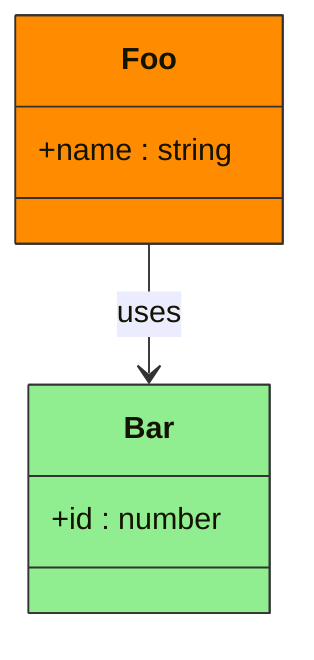
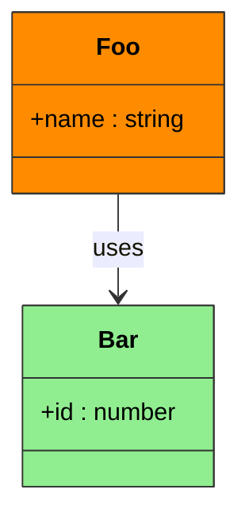
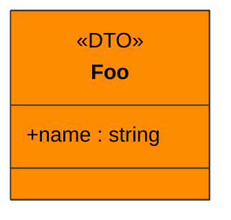
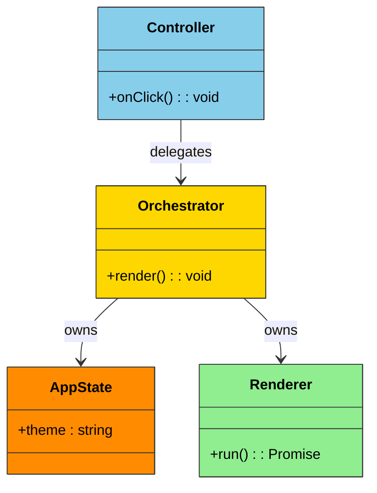

# Mermaid classDiagram coloring know-how

**Tested:** 2026-03-05
**Mermaid version:** 11.12.2 (GRSMD CDN)

---

## Summary

Only the `style` keyword works for coloring class nodes in classDiagram.
`classDef`, `:::`, `cssClass` are all ineffective or cause SyntaxError.

---

## Test Results

| Pattern | Method | Result |
|---------|--------|--------|
| P1 | `style Foo fill:...,stroke:...,color:...` | Colored |
| P2 | `classDef` + standalone `Foo:::orange` | **SyntaxError** |
| P3 | `classDef` + `cssClass "Foo" orange` | No color |
| P4 | `classDef` + `class Foo:::orange` (no body) | No color |
| P5 | `classDef` + `class Foo:::orange { ... }` (with body) | No color |
| P6 | `style` + `<<DTO>>` annotation | Colored |
| P7 | `classDef` with semicolons + `:::` | **SyntaxError** |
| P8 | `style Foo fill:...,stroke:...` (no color prop) | Colored |

---

## Recommended Pattern

Use `style` per class. The `color` property (text color) is optional.

**Minimal (P8 style):**

**With text color (P1 style):**

**With annotation (P6 style):**

---

## CA Layer Color Definitions

| CA Layer | fill | Usage |
|----------|------|-------|
| Entity | `#FF8C00` (orange) | Domain data (ApplicationState, CodeViewMeta) |
| Use Case | `#FFD700` (gold) | Business logic coordination (RendererOrchestrator) |
| Adapter | `#90EE90` (green) | External library / browser API adapters |
| Framework | `#87CEEB` (blue) | UI events / device input controllers |

**Example for 4 classes across CA layers:**

---

## Key Rules

1. **`style` is the ONLY working method** for classDiagram node coloring in Mermaid 11.12.2
2. **One `style` line per class** (no grouping syntax available)
3. **Place all `style` lines after relationships** (at the end of the diagram)
4. **`classDef` + `:::` causes SyntaxError** in classDiagram (works in flowchart only)
5. **`cssClass` silently fails** (no error, no color)
6. **Annotations (`<<DTO>>`, `<<abstract>>`) are compatible** with `style`
7. **`color` property is optional** but recommended for readability on colored backgrounds
