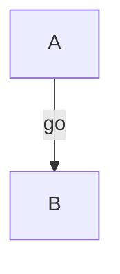
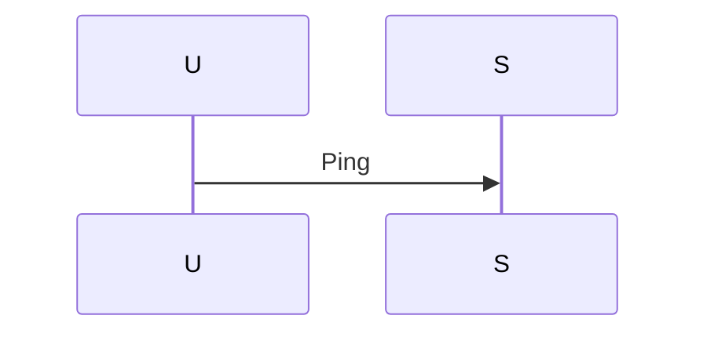
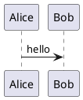
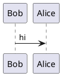

# Diagrams


```mermaid
flowchart TD
    A -->|go| B
```

Between the diagrams.


```mermaid
sequenceDiagram
    participant U
    participant S
    U->>S: Ping
```


```plantuml
@startuml
Alice -> Bob : hello
@enduml
```


```puml
@startuml
Bob -> Alice : hi
@enduml
```

```js
console.log("code");
```
